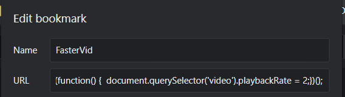

There are many great things of being a Frontend Developer. One of it is your knowledge of DOM API able to "unlock" features that is not provided by your site.

For instance, one of the things I do the most is to speed up video play speed, by using the following script in browser console:

```js
document.querySelector('video').playbackRate = 2;
```

However, being a lazy programmer, how do you able to make that snippets just one click away?

One way is to write a browser extension, which one day, you will have time to learn how to write.

Another way is to write a [bookmarklet](https://en.wikipedia.org/wiki/Bookmarklet).

Bookmarklet is simply saving your JS code in a bookmark so you can execute it.

For example, the bookmarklet-ized script of that previous script will be:

```js
javascript: (function() {
  document.querySelector('video').playbackRate = 2;
})();
```

And how you use that is to add a bookmark in your browser, by setting the script as the URL.



Now faster video is just a click a way!

You can even parameterized your bookmarklet with the `prompt` function:

```js
javascript: (function() {
  const playRate = prompt('How fast you want the video to be? (e.g. 2)');
  if (playRate) {
    document.querySelector('video').playbackRate = Number(playRate);
  }
})();
```
