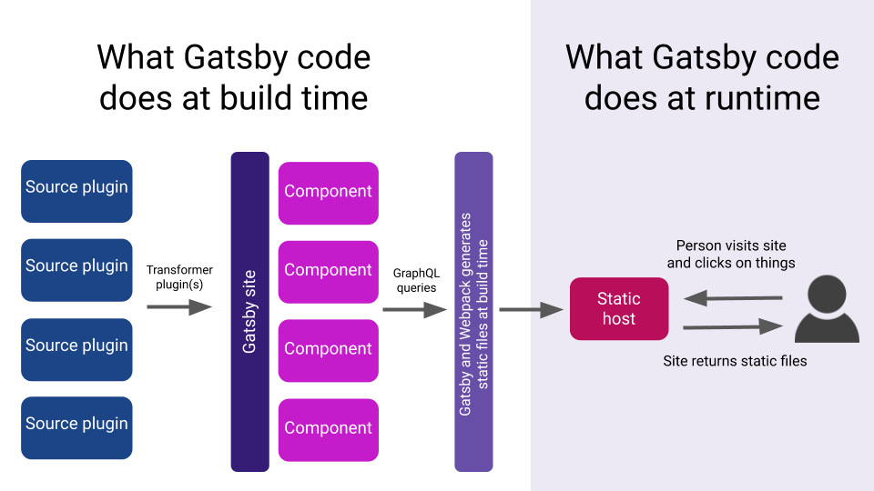

Figure above is the overview of how Gatsby works.

Gatsby works at two phases: build time and run time.

## Build Time

In modern frontend application development, _build_ is generally known as the process of translating your source code to efficient HTML/CSS/JS output that could be read and run by browser of your users.

Gatsby takes this concept further and includes data fetching and transformation in the build process, which are achived by source plugins and transformer plugins respectively.

Source plugins "sources" data from remote or local locations, such as

- API (REST/GraphQL)
- filesystems
- database

Gatsby has rich plugin libraries that may already able to source the data source that you need, such as [Wordpress](https://www.gatsbyjs.org/packages/gatsby-source-wordpress/), [Shopify](https://www.gatsbyjs.org/packages/gatsby-source-shopify), [MySQL Database](https://www.gatsbyjs.org/packages/gatsby-source-mysql) (which is maintained by yours truly), and even GitHub issues (like how I create comments system in this website).

If your data is a custom API that is developed and only used by your team, it's not hard to [create a custom source plugin](/fast-site-with-gatsby-js/create-source-plugin) too!

Once you get the data via source plugins, you may want to do additional transformation such as converting to different format or optimization, which is achieved by adding transformer plugin to your Gatsby site.

The result of the data sourcing and transformation is a GraphQL schema that you can used to inject the data into your React components.

Since all data are available in build time, Gatsby will run through the whole process and generate static assets which you can host easily.

## Run Time

Whenever your user visit your sites, your static assets with the data and contents injected will be returned to their browser, which make your page fast.

However, Gatsby doesn't stop there. As React able to reuse HTML that you have been generated with [its API][reactdom-server], the site will be "hydrated" into a React application once all the js files are downloaded by the browser, which means your Gatsby site can be as dynamic and powerful like any React application.

In addition, since Gatsby generates all your contents during build time, it could optimize your site for you with that knowledge:

- resources that are currently not within view (such as image at very bottom of your page) will only be loaded once your user scroll near to that image. (This technique is known as lazy-loading).
- resources that your user probably need very soon, such as the contents of the page whose link is currently seen by user will be retrieved in the background. This allows your page respond instantly when user interact with your page. (This technique is known as precaching).

<aside>

Gatsby follows the [PRPL pattern][prpl-pattern] developed by Google:

- **Push** critical resources for the initial URL route
- **Render** initial route
- **Pre-cache** remaining routes
- **Lazy-loadd** and create remaining routes on demand

If you interested on the how Gatsby is designed to achieve high performance, [this GitHub issue](gatsby-performance-issue) which was created at the start of Gatsby's 1.0 release will be an interesting read.

</aside>

[reactdom-server]: https://reactjs.org/docs/react-dom-server.html
[prpl-pattern]: https://developers.google.com/web/fundamentals/performance/prpl-pattern/
[gatsby-performance-issue]: https://github.com/gatsbyjs/gatsby/issues/431
