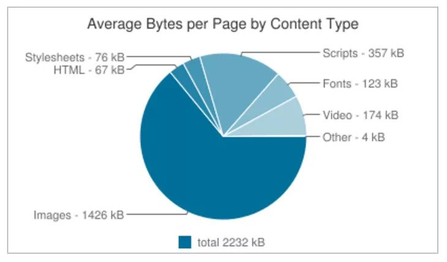

Image is easily the most heavy resources of many webpages.



However, to optimize image for webpages is not an easy feat. Ideally you need to:

- resize large images to the size needed based on design
- generate images of multiple size so the smaller screen only load the smaller images
- lazy load images to improve initial page load
- hold the image position so your page doesn't jump while images load
- use optimized image format like WebP but provide proper fallbacks if it is not supported by browser

Fortunately, Gatsby has include plugins and component to make all these optimization much easier.

## Use Gatsby Image in React Component

```bash
npm i gatsby-image gatsby-transformer-sharp gatsby-plugin-sharp
```

```javascript fileName=gatsby-config.js
module.exports = {
  plugins: [
    'gatsby-plugin-sass',
    {
      resolve: 'gatsby-source-filesystem',
      options: {
        name: 'src',
        path: `${__dirname}/src`,
      },
    },
    {
      resolve: 'gatsby-source-filesystem',
      options: {
        name: 'blogs',
        path: `${__dirname}/blogs`,
      },
    },
    'gatsby-transformer-remark',
    // highlight-start
    'gatsby-plugin-sharp',
    'gatsby-transformer-sharp',
    // highlight-end
  ],
};
```

```bash
mkdir src/images
```

Copy your photo into the images folder and name it as `my-image.jpg`.

<aside>

If you don't have a large photo in hand, open [placecorgi.com/1200/500](http://placecorgi.com/1200/500) and save the image.

</aside>

There are two types of responsive images supported by Gatsby:

1. Images that have a _fixed_ width and height. In this scenario, you want to have multiple image sizes for different screen resolutions.
1. Images that stretch across a _fluid_ container. In this case, you create multiple image sizes for different width.

### Load a Fixed Size Image

Let's load your photo by setting a fixed width of 500px.

```jsx fileName=src/pages/index.js
import { graphql } from 'gatsby';
import Image from 'gatsby-image'; // highlight-line
import * as React from 'react';
import { Layout } from '../components/layout';

const HomePage = ({ data }) => {
  const metadata = data.site.siteMetadata;
  const imageData = data.file.childImageSharp; // highlight-line

  return (
    <Layout>
      <h1>Welcome to {metadata.title}'s Website</h1>
      <p>{metadata.description}</p>
      {/* highlight-next-line */}
      <Image fixed={imageData.fixed} alt="Photo of Me" />
    </Layout>
  );
};

export const query = graphql`
  query HomePageQuery {
    site {
      siteMetadata {
        title
        description
      }
    }
    ${/* highlight-start */ ''}
    file(relativePath: { eq: "images/my-image.jpg" }) {
        childImageSharp {
            fixed(width: 500) {
              ...GatsbyImageSharpFixed
        }
      }
    }
    ${/* highlight-end */ ''}
  }
`;
```

### Load a Fluid Size Image

```jsx fileName=src/pages/index.js
import { graphql } from 'gatsby';
import Image from 'gatsby-image';
import * as React from 'react';
import { Layout } from '../components/layout';

const HomePage = ({ data }) => {
  const metadata = data.site.siteMetadata;
  const imageData = data.file.childImageSharp;

  return (
    <Layout>
      <h1>Welcome to {metadata.title}'s Website</h1>
      <p>{metadata.description}</p>
      {/* highlight-start */}
      <div style={{ maxWidth: 800, margin: '0 auto' }}>
        <Image fluid={imageData.fluid} alt="Photo of Me" />
      </div>
      {/* highlight-end */}
    </Layout>
  );
};

export const query = graphql`
  query HomePageQuery {
    site {
      siteMetadata {
        title
        description
      }
    }
    file(relativePath: { eq: "images/my-image.jpg" }) {
      childImageSharp {
        fluid(maxWidth: 800) {
          ...GatsbyImageSharpFluid
        }
      }
    }
  }
`;
```

## Use Gatsby Image in Markdown

```bash
npm i gatsby-remark-images
```

```javascript fileName=gatsby-config.js
module.exports = {
  plugins: [
    'gatsby-plugin-sass',
    {
      resolve: 'gatsby-source-filesystem',
      options: {
        name: 'src',
        path: `${__dirname}/src`,
      },
    },
    {
      resolve: 'gatsby-source-filesystem',
      options: {
        name: 'blogs',
        path: `${__dirname}/blogs`,
      },
    },
    // highlight-start
    {
      resolve: 'gatsby-transformer-remark',
      options: {
        plugins: [
          {
            resolve: 'gatsby-remark-images',
            options: {
              maxWidth: 700,
            },
          },
        ],
      },
    },
    // highlight-end
    'gatsby-plugin-sharp',
    'gatsby-transfomer-sharp',
  ],
};
```
