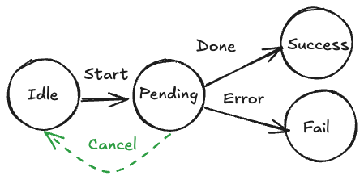

import CodeWalkthrough from '~/components/CodeWalkthrough.astro';

## Extra complexity for minimal gain

Many frontend engineers, myself included, viewed cancellation as an afterthought. "It's just a network request, what's the harm of letting it finish?" This perspective, while understandable, glosses over the implications of having a staling async operations running.

Frankly, cancellation seemed like an unnecessary complication. After all, the request usually reaches the server, and cancelling it on the client doesn't magically halt the server's processing. Plus, adding cancellation logic meant another branch of code to manage, another potential source of bug. _It felt like adding complexity for minimal gain_.

## Looking deeper

However, my simplistic view started to shift once I look deeper. It became clear that dismissing cancellation as "nice-to-have" was a just an excuse for my ignorance. Our frontend application often does more than fetch data and display it: subsequent processing, data manipulations, or state updates. A stray, uncancelled request becomes a source of unpredictability, leading to race conditions, inconsistent UI states, and overall application instability.

Consider a scenario where a user rapidly switches between tabs or typing search queries. Without proper cancellation, multiple requests might be fired off, and may be completed in any order. Each response then competes to update the UI, potentially leading to flickering, outdated data, and a confusing experience.

## Unpacking cancellation

Let's discuss few natures of cancellation that may not be obvious at first glance.

### Cancellation is an act of intent

We aim to stop an operation, but sometimes it's simply too late. The request might already be beyond the point of return, or the server might be too far along its process. It's about doing our best to clean up and prevent unnecessary work, not about guaranteed success.



If we look at the typical states of an async operation above, we can see that cancellation is only possible in the "Pending" state. Once the operation is in "Success" or "Error" state, it's too late.

### Cancellation in JavaScript is usually linked to asynchronous operations

Being a single threaded environment, JavaScript runtime execute synchronous operations in a blocking manner. This means that once a synchronous function or block of code begins, it runs to completion without yielding control back to the caller or any other process until it has finished its work. There is no "gap" for the process to check for a cancellation signal and be interrupted.[^1]

It's in the gaps between asynchronous operations, those moments where the code wait for a response, that we have the opportunity to check if the caller has the intention to cancel the operation.

### Cancellation is more than just that async operation

It's about cancelling the chain of events that follow. If a network request triggers subsequent processing or updates, cancelling the request also stop those subsequent operations.

Say, the following code:

```ts
async function showDashboard() {
  const data = await fetchDashboardData();
  const widgets = await fetchWidgets();

  await displayDashboard(data, widgets);

  pollForUpdates();
}
```

If the `fetchDashboardData` or `fetchWidgets` operation is cancelled, even if the network requests are already received by the server, we can still skip the `displayDashboard` and `pollForUpdates` operations.

This broader perspective turns cancellation from a minor async optimization into a key component of ensuring a consistent and reliable user experience.

## Incorporating cancellation into your code

The beauty of incorporating cancellation is that it doesn't necessarily require a complete overhaul of existing code. Most of us already use `try ... catch` blocks to handle errors of async operations. The key is to broaden our definition of what is being caught in the `catch` phrase. Instead of thinking it's catching error, think of it as catching **exception**. Cancellation is just another exception to be handled.

With this view, cancellation is less of an alien concept and more of an extension of our existing error handling.

- You can handle the cancellation in the `catch` block.
- If you do not want to handle the cancellation, you can let it propagate, just like normal error handling.

Let's dive into the details of how to implement cancellation in your code.

### Standardized cancellation

JavaScript has two built-in objects to standardize cancellation mechanism: `AbortController` and `AbortSignal`:

<CodeWalkthrough>

```ts twoslash
const abortController = new AbortController();

// How to abort the operation
// You can pass the cancellation reason, which is defaulted to `AbortError`.
abortController.abort();

//=====

//<- AbortSignal to read/listen for cancellation
const abortSignal = abortController.signal;

// How to check if the operation is cancelled
const isCancelled = abortSignal.aborted;

// How to listen for cancellation, if it's not cancelled yet
abortSignal.addEventListener('abort', () => {});

// How to check the reason of cancellation
const reason = abortSignal.reason;
```

</CodeWalkthrough>

### JS API that supports cancellation

You can pass the `AbortSignal` to `fetch` and `addEventListener` to make them cancellable:

```ts
async function fetchDashboardData({ abortSignal }: { abortSignal?: AbortSignal }) {
  const response = await fetch('/dashboard-data', {
    // [!code highlight:1]
    signal: abortSignal,
  });

  if (!response.ok) {
    throw new Error('Failed to fetch dashboard data');
  }

  return response.json();
}

async function listenForVisibilityChange({ abortSignal }: { abortSignal?: AbortSignal }) {
  document.addEventListener(
    'visibilitychange',
    (ev) => {
      fetchDashboardData({});
    },
    {
      // [!code highlight:1]
      signal: abortSignal,
    }
  );
}
```

Many NodeJS API also start supporting `AbortSignal` as an optional parameter, e.g.

```ts twoslash
import { createReadStream } from 'node:fs';

const abortController = new AbortController();

const readStream = createReadStream('file.txt', {
  signal: abortController.signal,
});

abortController.abort();
```

### Supporting cancellation in your code

It's straightforward to support cancellation in your code if the underlying implementation supports it - you just need to start accepting `AbortSignal` as an optional parameter and pass it to the underlying implementation.

However, what if the underlying implementation doesn't support cancellation?

In that case, you can't cancel the operation, but you can stop the chain of events that follow.

As an example, consider the following snippet:

```ts twoslash
async function displayText(text: string) {}

// ---cut---

async function readClipboardText() {
  return navigator.clipboard.readText();
}

async function showClipboardText() {
  const text = await readClipboardText();
  await displayText(text);
}
```

We want to support cancellation for both `readClipboardText` and `showClipboardText` functions.

To do that, we can start by accepting `AbortSignal` as an optional parameter in both functions:

```ts
// [!code highlight:1]
async function readClipboardText({ abortSignal }: { abortSignal?: AbortSignal }) {
  return navigator.clipboard.readText();
}

// [!code highlight:2]
async function showClipboardText(options: { abortSignal?: AbortSignal }) {
  const text = await readClipboardText(options);
  await displayText(text);
}
```

Then, we can use the `AbortSignal` in `readClipboardText`:

```ts
async function readClipboardText({ abortSignal }: { abortSignal?: AbortSignal }) {
  abortSignal?.throwIfAborted();

  return new Promise<string>((fulfill, reject) => {
    abortSignal?.addEventListener('abort', () => reject(abortSignal.reason));

    navigator.clipboard.readText().then(fulfill).catch(reject);
  });
}
```

Note that even though `navigator.clipboard.readText` could not be cancelled, we can still cancel the chain of events that follow (execute `displayText`) if the `AbortSignal` is aborted before `readClipboardText` is completed.

## Conclusion

Cancellation in frontend engineering is more than just stopping network requests - it's about maintaining control over your application's state and user experience. While it may seem like an optional optimization, proper cancellation handling is essential for preventing race conditions, reducing unnecessary processing, and ensuring UI consistency. The good news is that modern JavaScript provides robust tools like `AbortController` and `AbortSignal` that make implementing cancellation straightforward. By treating cancellation as a first-class concern alongside error handling, you can build more reliable and responsive applications without significantly increasing code complexity.

[^1]: Technically, you can make a synchronous function cancellable by checking for the cancellation signal within the function. However, it is seldom done in practice because checking for cancellation signal introduces additional overhead.
