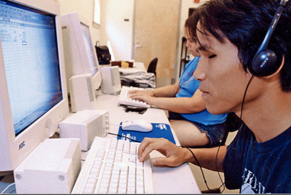
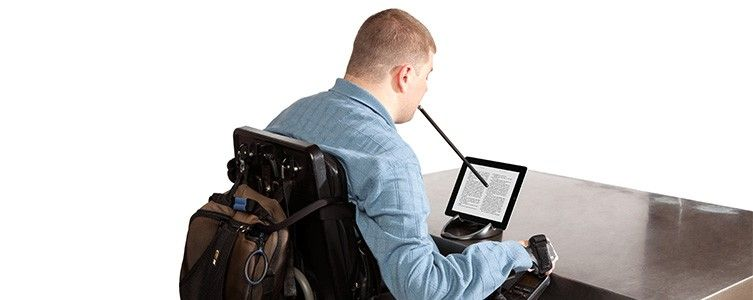
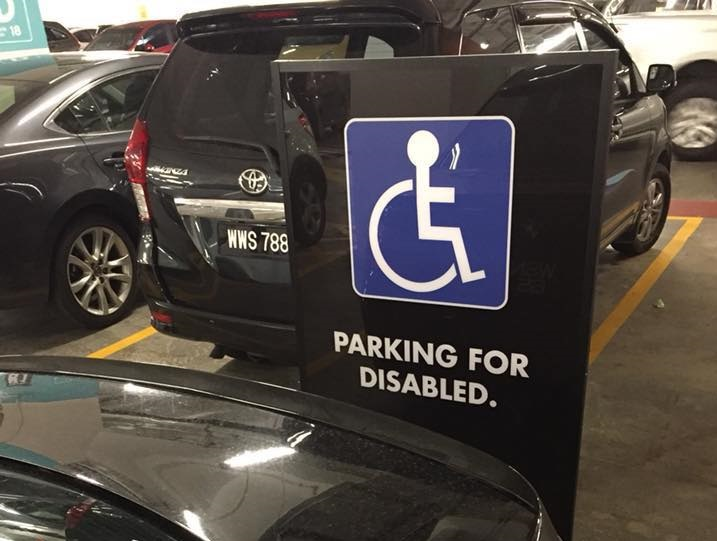

Everytime I see disabled people on the street moving with wheelchair on their own, or blind people taking LRT themselves, usually two thoughts will come to my mind.

First, I feel sorry for them. Life must be very challenging for them.

Second, I feel a slight happiness. Not because that I'm not disabled, but because I think that our public facilities for disabled people have been improved to the point where disabled people feel confident to move around the city on their own.

I think that's how a good society should be, not giving disabled people privilege or special treatment, but let them able to live independently as a person, without depending on others.

## How Disabled People Use Internet

While it may be seems obvious that physical space should be accessible to everyone, it's not so obvious when coming to virtual space, i.e. websites.

The problem is people seldom think of how disabled people use websites. A normal people like me (and probably you) usually use mouse to click or finger to tap, and switch to use keyboard when need to type something. If you are disabled, or partially disabled, how do you browse website?

For some people that has motor skill difficulty, they may only use keyboard only without mouse because mouse is too challenging for them. For them, web browser is all about tabbing to what they interest, and press space/enter to navigate.

For blind people, you use something called screen reader, which is a piece of software that will read through website, and read it to them. For them, it's almost similar to the keyboard-only user, but they listens instead of see.

If you can't use your hand, you would use something called mouse stick, which is actually mouse held with your mouth. Holding the stick with your mouth, while hoping the button is larger so that the stick can hit it easily, is how it goes usually.

## Are You An A\*\*hole?

Now you know how disabled people browse website, is your website accessible to them?

Can your website used only with keyboard? Do you use `div` and style it as button, and nobody can ever tab themselves to them?

Do you have proper `alt` attribute on your image, so blind person can understand what's going on? Do you associate your `label` with `input` properly?

Is your button big enough for people using mouse stick to be able to focus on?

Or your answer is, you doesn't care?

Like the a\*\*hole that park on the reserved parking for disabled people?

_(Photo from [You Park Like An Asshole](https://www.facebook.com/groups/betterMalaysia/) Facebook group)_

If you are the a\*\*hole, I have nothing else to say.

If you aren't, think of accessibility when you're writing code tomorrow.

Test your code with keyboard only, ask yourself, can a disabled person use this?

If your boss doesn't care, try to persuade him. An engineer would advise his client when the design is bad for the residents, aren't you a software engineer?

If your designers doesn't care, teach them. They say they like feedbacks, aren't they?

Or even better, just write accessible code. They can't tell that extra 20 minutes difference anyway, isn't it?

At the end of the day, most of us love our programming job not because we like the approval of our boss or designer, but the joy of make something coming to life.

Increase the joy of our work by making the code accessible.

It's like helping a disabled person cross the street, you feel warmness within and proud of yourself when thinking about it.

Be human while you code.
