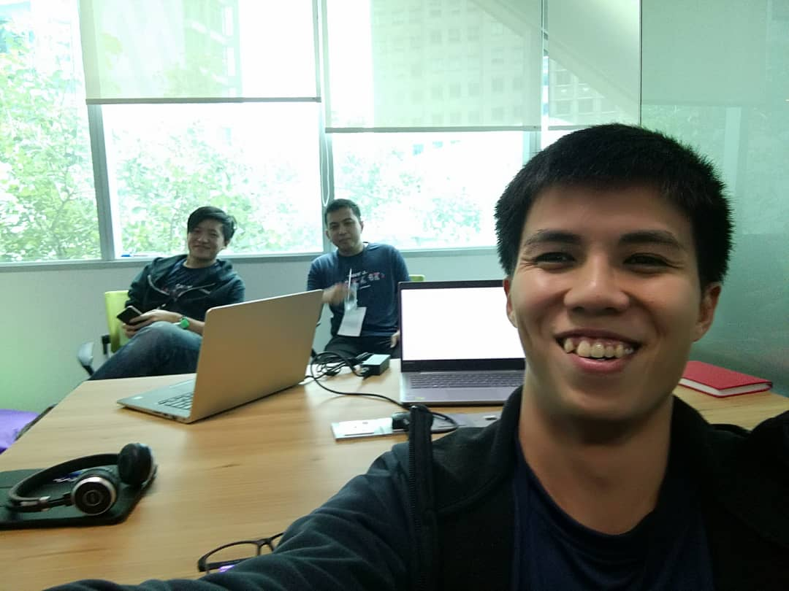

After being a full-time developer for a couple of years, this is my first time joining a hackathon.

To be frank, I'm slightly against the idea of hackathon because I feel like it romantize programming, i.e. pushing programmers to work long hours would make magic happens.

Another reason I'm not interested in hackathon because I imagine it's joined by a bunch of people excited about programming. And I personally believe that most things, like cooking, the more excited you are, the worse the outcome will be.

Anyway, I did join this one. One of my workshop student, Matt, asked me if I'm interested to team up with him to join a hackathon organized by Hong Leong Bank, and god knows why, I say yes.

## The Team

Our team consists of:

1.  Matt - a guy working in Bank Compliance Department (the team leader)
1.  Ale - a guy working in Panasonic air-conditioner embedded system
1.  Malcolm - that's me

Matt registered our team name as "Overeact" (don't ask me what does it means, I never ask), but somehow in the organizer system we appears as "Ordinary". =.=

So we're "Ordinary" then.

## The Idea

Because the organizer did announce the scope of the hackathon in advance, so we can discuss the idea of our project in advance.

The idea we come up with is to build a marketplace for loan. As a customer, you just come to the site, apply once, and the site would help you submit to multiple banks and get the results from all of them. Because Matt is more familiar with car loan, so we decided to focus on car loan only.

We were quite happy with the idea.

## The Challenge

Before I joined the hackathon, I thought how the hackathon happens is just a bunch of people sitting in the same area, and everyone are just coding, just like any other typical IT office (with the difference of the number of women is much higher than usual).

What actually happens is, while you coding, there are some people known as Mentors will walk around and ask you about your ideas. These Mentors are actually Subject Matter Expert (SME) that works for the bank, and they're there to give you feedbacks about your ideas.

Lo and behold, we get a lot challenges about our idea:

1.  Why Hong Leong Bank interested in this idea? You're making other competitors easier to get loan too.
1.  Today car loan are actually handled by the car dealer, customer don't really need to apply themselves. So your idea doesn't solve existing pain point.

We spend a lot of times to brainstorm how to change our idea or how to answer those challenge, but we don't really have a good answer.

And I
