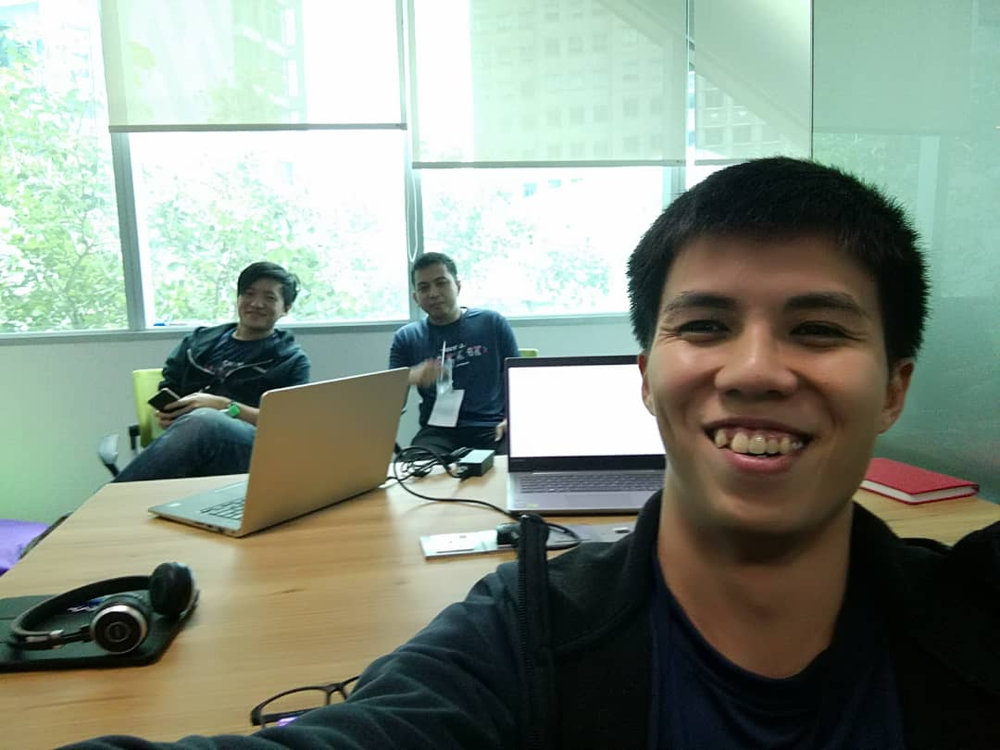
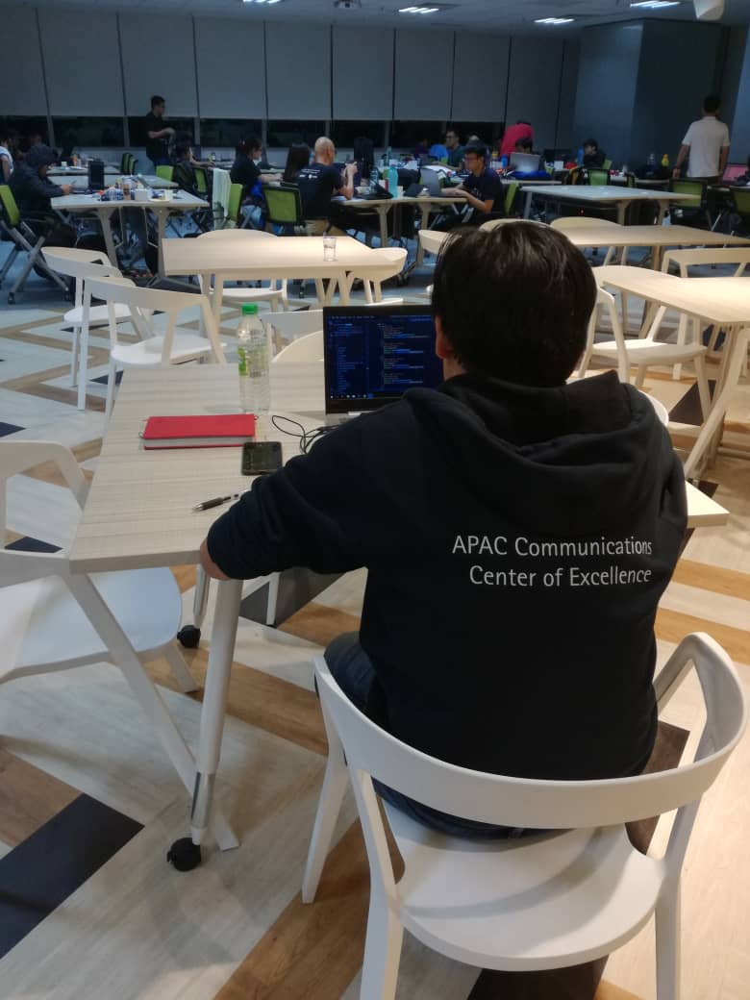
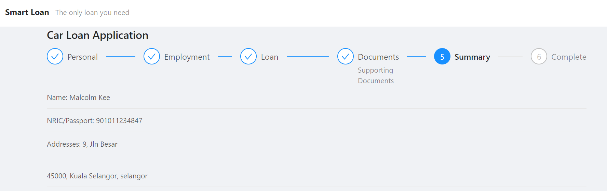
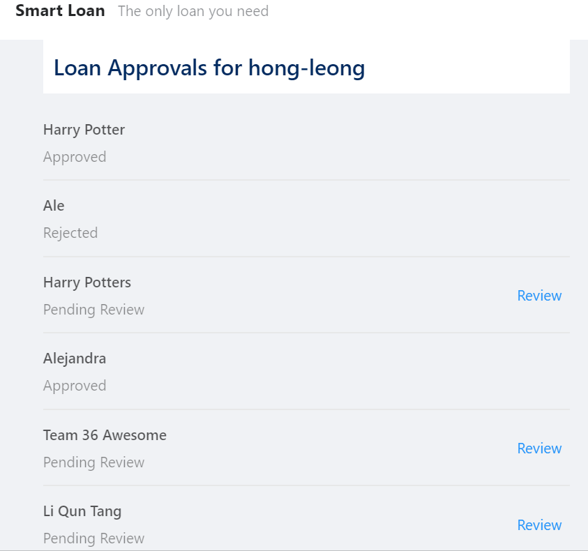
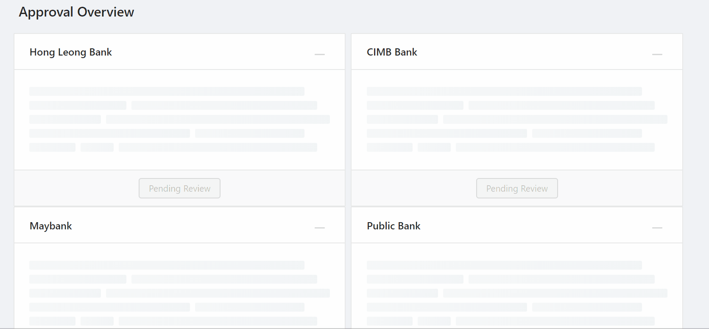
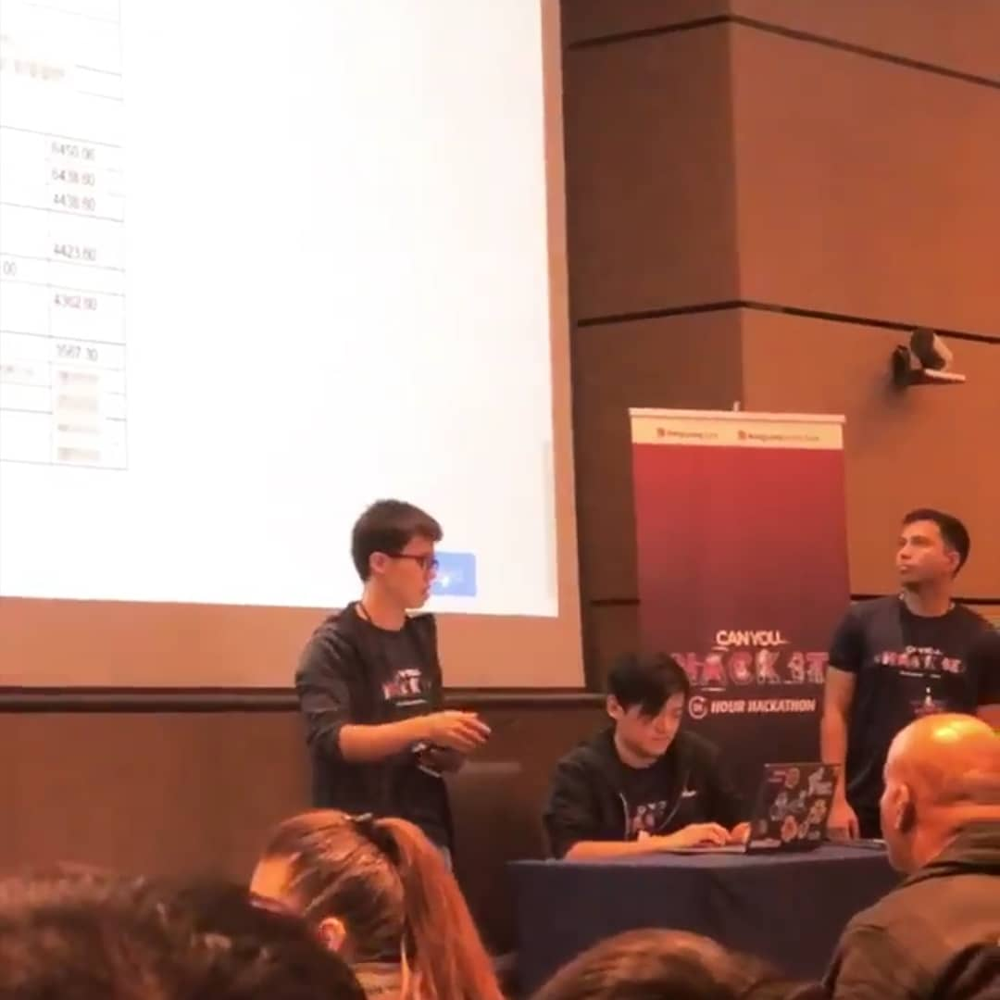

Last week I joined a hackathon organized by Hong Leong Bank, [Can You Hack It][can-you-hack-it].

After being a full-time developer for a couple of years, this is my first time joining a hackathon.

To be frank, I'm slightly against the idea of hackathon because I feel like it romanticises programming, i.e. pushing programmers to work long hours would make magic happens.

Another reason I didn't thinking of joining a hackathon because I imagined it's joined by a bunch of people excited about programming. And I believe that programming, like cooking, the more apparent your excitement when doing it, the more likely you're an amateur.

Anyway, I did join this one. One of my workshop student, Matt, asked me if I'm interested to team up with him to join a hackathon organized by Hong Leong Bank, and god knows why, I say yes.

## The Team

Our team consists of:

1.  Matt - the team leader, who works in Bank Compliance Department
1.  Ale - works in Panasonic air-conditioner embedded system
1.  Malcolm - that's me

Matt registered our team name as "Overeact" (perhaps getting inspiration from Dan Abromov's blog, [Overreacted]? I never ask), but somehow in the organizer system we appears as "Ordinary". =.=

So we're "Ordinary" then.

## The Idea

Because the organizer did announce the scope of the hackathon in advance, so we can discuss the idea of our project in advance.

The idea we come up with is to build a marketplace for loan. As a customer, you just come to the site, apply once, and the site would help you submit to multiple banks and get the results from all of them. Because Matt is more familiar with car loan, so we decided to focus on car loan only.

We were quite happy with the idea.

## The Challenge

Before I joined the hackathon, I thought how the hackathon tranpires is just a bunch of people sitting in the same area, and everyone are just coding, just like any other typical IT office (with the difference of the number of women is much higher than usual).

What actually happens is, while you coding, there are some people known as Mentors will walk around and ask you about your ideas. These Mentors are actually Subject Matter Expert (SME) that works for the bank, and they're there to give you feedbacks about your ideas.

And we get a lot challenges about our idea:

1.  Why Hong Leong Bank interested in this idea? You're making other competitors easier to get loan too.
1.  Today car loan are actually handled by the car dealer, customer don't really need to apply themselves. So your idea doesn't solve existing pain point.

We spend a lot of times to brainstorm how to change our idea or how to answer those challenge, but we don't really have a good answer.

Halfway through, I was like, we wouldn't have enough time to build the prototype if we keep discussing, so I just excuse myself and let the other two guys continue the discussion. I've became the nerdy programmer that not interested in contributing to idea and only like to write code in his own world. The idea is that I will build the prototype based on the original idea, so in case we won't have better idea, at least we have something to present.

In retrospect, I think I'm just avoiding the tough problem (figuring out what to build), and choose to do what's easy for me (implementing). I could of course argue that I'm doing what's best for the team, but to be honest, that was not the reason.

A curse of ability, you could say, where I talk myself out from tackling a hard problem when I'm good at solving an easy problem.

## The User Journey

There are actually 3 main screens I needed to develop:

1.  Application Form

    This is the form where interested customer provide their information that are required for a car loan application, such as car price, salary etc. We also allow them to upload their personal documents such as IC or pay slip.

    Once the form is submitted, customer will receive an email that list down the details that they provided and a sms that provide a link for them to view the approval status (3rd main screen).

1.  Bank Approval Portal

    This is the part where bank can see the list of customers that applying the loan, review their details, and enter the approved amount, approved interest rate, or reject the application.

1.  Approval Status Portal

    This is the part where customer can see the overview of the status of their loan application.

What had been considered but abandoned is the feature for customer to update their details.

## The Technology

Because I'm the only one doing web development professionally in the team, so the technology we chose are chosen by me arbitrarily without much discussion and careful consideration:

1.  Frontend

    [ReactJS] with Typescript. Because it's the frontend framework that I can code most productively. I chose [Ant Design][antdesign] as the component library because there seems quite complete, and I want to take the opportunity to use them.

1.  Backend

    [Firebase]. I knew we need to allow customer to upload their document, and I never created backend for storage, so I decided to not learn that in this hackathon and use Firebase instead. The Firebase modules we used are storage, Realtime Database, hosting, and Functions.

1.  Third Party

    Rakuten Rapid API. This part is actually requirement from the organizer for us to integrate with at least one API in their list. Ale and Matt figured out how to call Rakuten API to send sms and email, and I just copy-pasta the code into a firebase Functions that get triggered for each form submission.

## The Result

### The Application Form

### The Bank Approval Portal

### Approval Status Portal

The code are hosted in [this GitHub repository][code-repo].

The live version of the site are available [here][firebase-site]. However, the firebase project had been removed from our team Google account, so I no longer control it and I'm not sure when Google will remove it.

## The Outcome of the Hackathon

So, did we won anything?

We made it to top 10, but sadly we didn't make it to the Top 3, and I'm not bitter about it, because I think our idea are not special and not using some advanced technology e.g. AI or AR etc.

It's just that, the Top 3 winners are... as disappointing as ours. There are other top 10 finalist that I think are more promising.

And unfortunately the judging process is quite opaque, and I knew a few participants felt the judging the same too.

Well, maybe that's why I'm not the judge.

## Epilogue

Two days after the hackathon, I was sick for few days.

Just a note to self to remember what I sign up for if I want to join another hackathon in future.

[can-you-hack-it]: https://www.hlb.com.my/en/personal-banking/about-us/careers/can-you-hack-it.html
[overreacted]: https://overreacted.io/
[reactjs]: https://reactjs.org/
[antdesign]: https://ant.design/
[firebase]: https://firebase.google.com/
[code-repo]: https://github.com/malcolm-kee/react-project-base
[firebase-site]: https://team36.firebaseapp.com/
