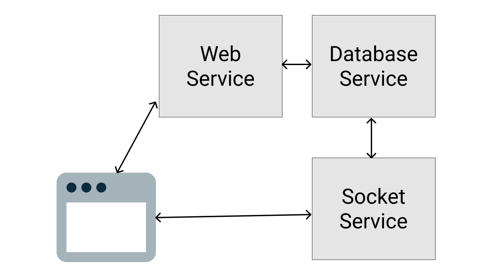
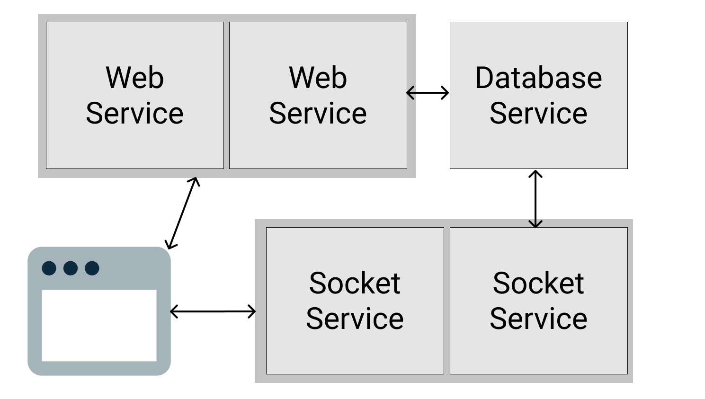

"How does that scale?" is not a common question frontend developer asks.

That's because for frontend, the code runs on clients (which are mostly browsers), and they live in users' machine/phone, so scaleability is usually not an issue.

However, sometimes you need to worry about that. Maybe your backend developer is busy and your PM ask you the question, or you're just being asked that question in an interview (which is what happened to me recently).

After doing some readings and going through some interviews, my understanding of that question can be translated to:

Can we increase capacity by buying more low-spec servers?

"Buying more low-space servers", also known as horizontal scaling, is the scaling of services by duplicating applications in multiple servers. It is usually cheaper than vertical scaling, which is upgrading your server's computing power. (Why cheaper? Just like mobile phones, for similar computing power, buying four 1GB-RAM Android phones is much cheaper than buying a 4GB-RAM Android phones.)

In order for you to achieve that, usually you need to split your applications to smaller stateless and stateful applications. Stateless applications are applications that doesn't store data by themselves, instead they will delegates the data storage to stateful applications. Stateful applications is the opposite of stateless applications, they store data. A way to look at it is stateless applications are like pure function in programming world.

Stateless applications are usually easily horizontally scaleable while stateful applications would need special handling. This is because since stateless applications themselves doesn't store any data, each requests going through it is independent, so you can create multiple instances of them to distribute the load.

For example, assuming you have an e-commerce application consists of the following features:

- web service to handle API calls from clients
- database service to persist the order status and customer information
- socket service to allows two-ways web socket communications with clients

Of all the three services, only database is stateful, so if these 3 services are independent applications, we can easily duplicate web services and websocket services:

- For this to happens, the services should be independent, this is why microservice architecture is so appealing.
- Note that web service doesn't have to scale together with socket service. We can scale up web service while maintaining websocket service, and vice versa.
- One thing that is not drawn out in the diagram is the load balancer. Load balancer stands between the client and your web service and socket service, and its role is distributing the incoming requests across the servers. A popular load balancer is [Nginx](https://www.nginx.com/).

## What about the Stateful Service?

How can we scale the database service in the example above?

There are no standard answer for this, it really depends on the type of the service and the application logic that you work on.

However, the two most common approaches are:

- if the stateful service supports scaling, then use that. For instance, most databases software like MongoDB and MySQL supports clusters, which is fancy way to say they supports distributing their processing across multiple servers.

- if the stateful service does not support scaling (e.g. the COBOL backend that is older than you), another popular approach is to add a queue.

  - instead of your stateless services (which are easily scaled) calling stateful service directly, which may overload your stateful service, the stateless services can only place the requests to a queue.
  - the stateful service can take his time to pick up the requests whenever his is able to.
  - the queue prevents high traffic to kill your stateful service, but nothing is free in software engineering. The queue makes the response asynchronous, which requires a way to notify the clients when the response is available. If this extra complexity is not something you want to introduces, then queue is not a good solution.

Of course, if both approaches do not work, you still have a last resort: upgrade your server, which even your father-in-law can propose if he can pronounce server.
