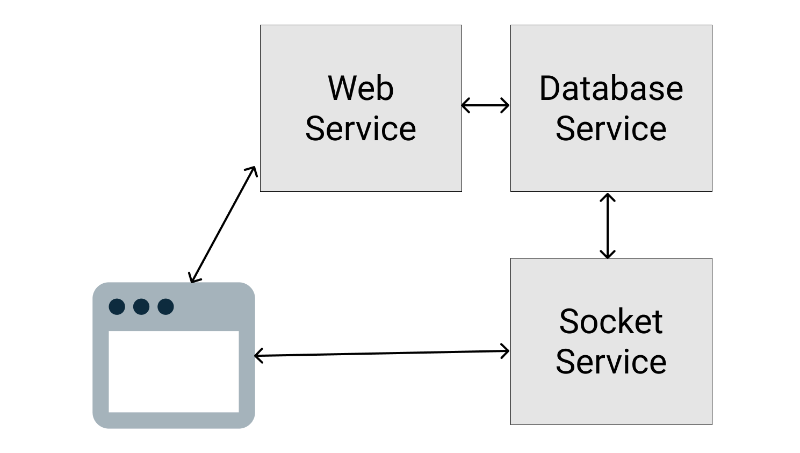
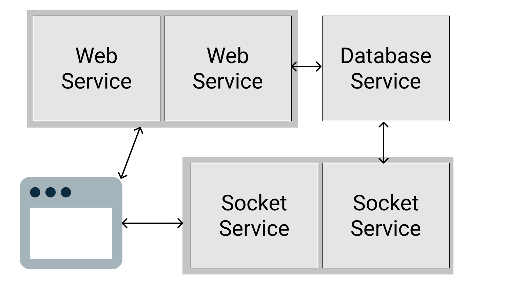

"How does that scales?" is not a common question frontend developer asks.

That's because for frontend, the code runs on clients (which are mostly browsers), and they live in users' machine/phone, so scaleability is usually not an issue.

However, sometimes you need to worry about that. Maybe your backend developer is busy and your PM ask you the question, or you're just being asked that question in an interview (which is what happened to me recently).

After doing some readings and going through some interviews, my understanding of that question can be translated to:

Can we increase capacity by buying more low-spec servers?

"Buying more low-space servers", also known as horizontal scaling, is the scaling of services by duplicating applications in multiple servers. It is usually cheaper than vertical scaling, which is upgrading your service computing power. (Why cheaper? Just like mobile phones, for similar computing power, buying five 1GB-RAM Android phones is much cheaper than buying a 4GB-RAM Android phones.)

In order for you to achieve that, usually you need to split your applications to smaller stateless and stateful applications. Stateless applications are usually easily horizontally scaleable while stateful applications would need special handling.

For an example, assuming you have an e-commerce application consists of the following features:

- web service to handle API calls from clients
- database service to persist the order status and customer information
- websocket service to push new updates to clients

Of all the three services, only database is stateful, so if these 3 services are independent applications, we can easily duplicate web services and websocket services:

- For this to happens, the services should be independent, this is why microservice architecture is so appealing.
- Note that web service doesn't have to scale together with websocket service. We can scale only web service if the load of websocket service is low, and vice versa.

## What about the Stateful Service?

How can we scale the database service in the example above?

There are no standard answer for this, it really depends on the type of the service and the application logic that you work on.

However, the two most common approaches are:

- if the stateful service supports scaling, then use that. For instance, most databases software like MongoDB and MySQL supports clusters, which is fancy way to say they supports distributing their processing across multiple servers.

- if the stateful service does not support scaling (e.g. the COBOL backend that is older than you), another popular approach is to add a queue. The idea is that your stateless services (which are easily scaled) cannot communicate with the stateful service directly. Instead, they can only put the request to a queue, which the stateful service can take his time to pick up the request whenever his is able to. This prevents high traffic to kill your stateful service, but it makes your code more complex as you need to find ways to notify the clients when your stateful service finish processing. Sometimes, this is just not feasible.

Of course, if both approaches do not work, you still have a last resort: upgrade your server, which even your father-in-law can propose if he can pronounce server.
