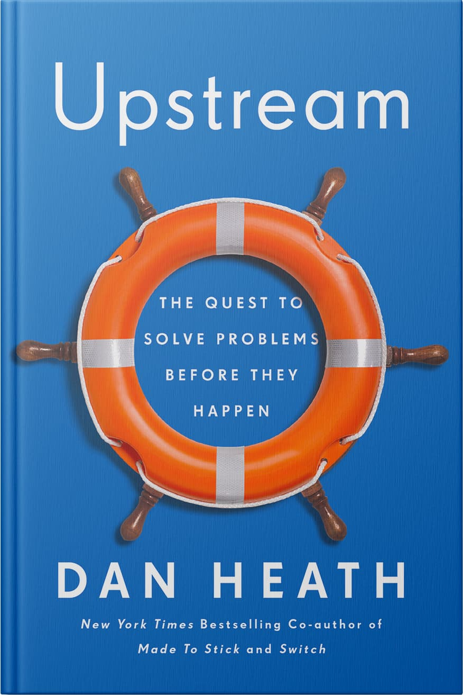

You must have heard of the phrase "fix the problem, not the symptom".

I recently read a book about that.

The book is really insightful and thought-provoking, just like any other books by the [Heath Brothers](https://heathbrothers.com/).

One of the insights that I love is we can use the metaphor of a water stream to analyze problem/symptom.

Imagining the river near your home is dirty. So you try to remove all the dirty things from the dirty, but it's still dirty.

The problem is that, the source of the river is dirty. To fix the problem, you need to "go upstream". In other words, instead of fixing the _symptom_ that your river is dirty, you should fix the _problem_ of your bad neighbour that keep throwing rubbish to the river.

In theory, that's how we should try to fix all the problems in our life.

In practice, that's a problem of trying to fix the problem instead of symptom.

The problem is that you can endlessly go upstream, in many directions.

Imagine if you have a fight with your colleague because you said something that offends him.

You may think of the problem is he is being too sensitive, so if he can just be more rational next time the problem will not happen again. So you complain to your friend/family/lover about how stupid he is, and mumbling how can someone be so irrational.

But that could just be a symptom. It's a symptom of the bad working relationship between you two. Looking from this perspective, your manager may organize team-building activities, trying to improve relationship between you.

On the other hand, from your perspective, you may realize that you also contribute to the problem. Maybe you should be more careful with your wording, it never harms to be more polite.

And you can continue to "go upstream" further. Perhaps you wasn't a harsh person before this. The problem is your current job is stressful and toxic, making you a grumpy person. To solve the problem, maybe you should just fire your boss.

Even though this means there is no definite answer to solve a problem. Nonetheless, many good managers and programmers that I know seems to possess this ability to think upstream and see if an alternative solution is more optimal to solve a particular problem. Often, a hard problem can be solved by eliminating the upstream that is causing it.

---

So, what's the conclusion?

The conclusion is you can always blame your job for all your unhappiness in life if you willing to go upstream until you can blame it.
