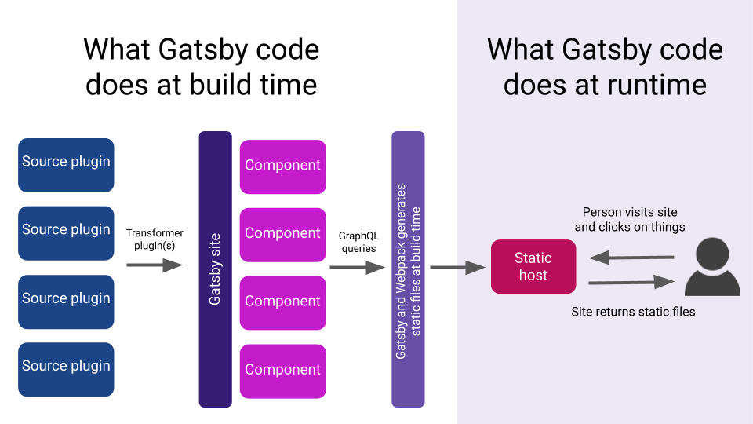

<figure>
  
  <figcaption>
    GatsbyJS overview (
    <a href="https://docs.google.com/presentation/d/1fQNLvf1C8kj4rY-hVVY5zCsxy0z03gGkiqc-wiHHYhI/edit#slide=id.g3c7946ead0_0_0">
      Source
    </a>
    )
  </figcaption>
</figure>

Figure above is the overview of how Gatsby works.

Gatsby works at two phases: build time and run time.

## Build Time

Source Plugin

## Run Time

Prefetching

Lazy Loading
