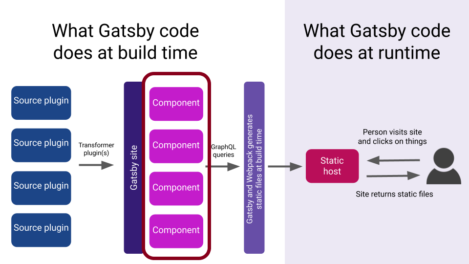

## Setup Gatsby Project

```bash
mkdir learn-gatsby
cd learn-gatsby
npm init --y
```

- `mkdir` is the command to create a folder in bash command prompt. It's equivalent to right click on File Explorer > New Folder.
- `cd` is change directory. `cd learn-gatsby` is equivalent to double click the "learn-gatsby" folder.
- `npm init` is an utility command to start a new projects, which is actually creating a `package.json` file in current folder. By default it will ask you few questions that you need to reply one-by-one, but I am lazy and add the `--y` flag to automatically answer `Yes` for all the questions.

You should see a `package.json` created in learn-gatsby folder.

```json fileName=package.json
{
  "name": "learn-gatsby",
  "version": "1.0.0",
  "description": "",
  "main": "index.js",
  "scripts": {
    "test": "echo \"Error: no test specified\" && exit 1"
  },
  "keywords": [],
  "author": "",
  "license": "ISC"
}
```

Now let's install the libraries we need:

```bash
npm install react react-dom gatsby
```

- `npm install` installs third-party libraries for your project. It will download the libraries and put them in `node_modules` folder and add the libraries' name and version in the `package.json` file.

```json fileName=package.json highlightedLines=12,13,14,15,16
{
  "name": "learn-gatsby",
  "version": "1.0.0",
  "description": "",
  "main": "index.js",
  "scripts": {
    "test": "echo \"Error: no test specified\" && exit 1"
  },
  "keywords": [],
  "author": "",
  "license": "ISC",
  "dependencies": {
    "gatsby": "^2.13.7",
    "react": "^16.8.6",
    "react-dom": "^16.8.6"
  }
}
```

Next, let's setup our repository so we can properly record our changes and push it to GitHub.

```bash
touch .gitignore
```

```text fileName=.gitignore
.cache
node_modules
/public
```

```bash
git init
git add .
git commit -m "initial commit"
```

## Create First Page



```bash
mkdir -p src/pages
touch src/pages/index.js
```

```jsx fileName=src/pages/index.js
import React from 'react';

const HomePage = () => {
  return (
    <div>
      <h1>Welcome to Malcolm Kee's Website</h1>
      <p>crafted with tears and love.</p>
    </div>
  );
};

export default HomePage;
```

```json fileName=package.json highlightedLines=7
{
  "name": "learn-gatsby",
  "version": "1.0.0",
  "description": "",
  "main": "index.js",
  "scripts": {
    "start": "gatsby develop"
  },
  "keywords": [],
  "author": "",
  "license": "ISC",
  "dependencies": {
    "gatsby": "^2.13.7",
    "react": "^16.8.6",
    "react-dom": "^16.8.6"
  }
}
```

```bash
npm start
```

Open [localhost:8000](http://localhost:8000) and you should able to see your page. Try to edit the content and see how the content is updated instantly.

```bash
git add .
git commit -m "add home page"
```

## Create Not Found Page

```bash
touch src/pages/404.js
```

```jsx fileName=src/pages/404.js
import React from 'react';

const NotFoundPage = () => {
  return (
    <div>
      <h1>Page Not Found</h1>
      <p>Man... I'm sorry for you</p>
    </div>
  );
};

export default NotFoundPage;
```

```bash
git add .
git commit -m "add not found page"
```

## Use React Components to Compose Your Page

```bash
mkdir src/components
touch src/components/header.jsx
touch src/components/layout.jsx
```

```jsx fileName=src/components/header.jsx
import React from 'react';

export const Header = () => {
  return <header>Malcolm Kee</header>;
};
```

```jsx fileName=src/components/layout.jsx
import React from 'react';
import { Header } from './header';

export const Layout = ({ children }) => {
  return (
    <>
      <Header />
      {children}
    </>
  );
};
```

Then use the `Layout` component in both our home page and not found page:

```jsx fileName=src/pages/index.js
import React from 'react';
import { Layout } from '../components/layout'; // highlight-line

const HomePage = () => {
  return (
    //   highlight-next-line
    <Layout>
      <h1>Welcome to Malcolm Kee's Website</h1>
      <p>crafted with tears and love.</p>
      {/* highlight-next-line */}
    </Layout>
  );
};

export default HomePage;
```

```jsx fileName=src/pages/404.js
import React from 'react';
import { Layout } from '../components/layout'; // highlight-line

const NotFoundPage = () => {
  return (
    // highlight-next-line
    <Layout>
      <h1>Page Not Found</h1>
      <p>Man... I'm sorry for you</p>
      {/* highlight-next-line */}
    </Layout>
  );
};

export default NotFoundPage;
```

```bash
git add .
git commit -m "add layout component"
```

## Linking Pages

Let's add third page in our site

```bash
touch src/pages/about-me.js
```

```jsx fileName=src/pages/about-me.js
import React from 'react';
import { Layout } from '../components/layout';

const AboutMePage = () => {
  return (
    <Layout>
      <h1>Malcolm Kee</h1>
      <ul>
        <li>Full-Snack Developer</li>
        <li>KL, Malaysia</li>
      </ul>
    </Layout>
  );
};

export default AboutMePage;
```

Let's add the link to this new page from home page:

```jsx fileName=src/pages/index.js
import { Link } from 'gatsby'; // highlight-line
import React from 'react';
import { Layout } from '../components/layout';

const HomePage = () => {
  return (
    <Layout>
      <h1>Welcome to Malcolm Kee's Website</h1>
      <p>crafted with tears and love.</p>
      {/* highlight-next-line */}
      <Link to="/about-me">About</Link>
    </Layout>
  );
};

export default HomePage;
```

Add the link to home page from Not Found page and About page:

```jsx fileName=src/pages/404.js
import { Link } from 'gatsby'; // highlight-line
import React from 'react';
import { Layout } from '../components/layout';

const NotFoundPage = () => {
  return (
    <Layout>
      <h1>Page Not Found</h1>
      <p>Man... I'm sorry for you</p>
      {/* highlight-next-line */}
      <Link to="/">Home</Link>
    </Layout>
  );
};

export default NotFoundPage;
```

```jsx fileName=src/pages/about-me.js
import { Link } from 'gatsby'; // highlight-line
import React from 'react';
import { Layout } from '../components/layout';

const AboutMePage = () => {
  return (
    <Layout>
      <h1>Malcolm Kee</h1>
      <ul>
        <li>Full-Snack Developer</li>
        <li>KL, Malaysia</li>
      </ul>
      {/* highlight-next-line */}
      <Link to="/">Home</Link>
    </Layout>
  );
};

export default AboutMePage;
```

## Build and Deploy Your Gatsby Site

```json fileName=package.json highlightedLines=8,9
{
  "name": "learn-gatsby",
  "version": "1.0.0",
  "description": "",
  "main": "index.js",
  "scripts": {
    "start": "gatsby develop",
    "build": "gatsby build",
    "serve": "gatsby serve"
  },
  "keywords": [],
  "author": "",
  "license": "ISC",
  "dependencies": {
    "gatsby": "^2.13.7",
    "react": "^16.8.6",
    "react-dom": "^16.8.6"
  }
}
```

```bash
npm run build
npm run serve
```

Then open [localhost:9000](http://localhost:9000) to view the optimized static files.

- push code to GitHub repo
- create account in Netlify
