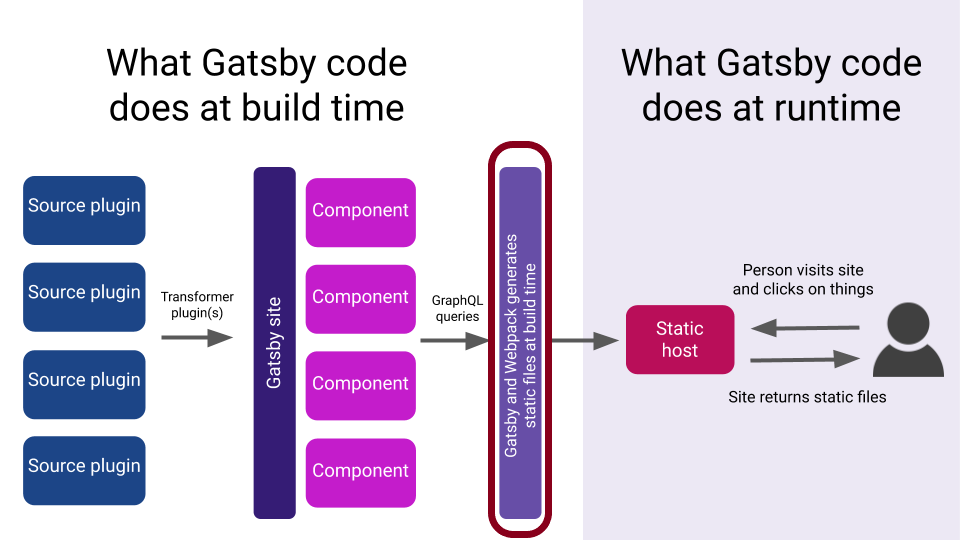

Gatsby plugins are how we customize Gatsby site to fit our specific use case.

Gatsby plugins can:

- add external data or content (this kind of plugin is known as source plugin, which will be covered [later](/fast-site-with-gatsby-js/source-plugin))
- transform data (this kind of plugin is known as transformer plugin, which will also be covered [later](/fast-site-with-gatsby-js/transformer-plugin))
- customize the build process (what we will do now)

In this exercise, we're going to configure our Gatsby to process Sass.

## What is Sass?

[Sass] is a language that extends CSS. Together with [less] and [stylus], they are known as CSS pre-processors because you need to run though your source code with a processor that will generates valid CSS.

To illustrate the purpose of using a CSS pre-processor, let's look at the following CSS:

```css
.btn {
  color: hsl(12, 78%, 45%);
  background-color: white;
}

.btn:hover {
  background-color: #eeeeee;
}
```

The code seems fine, but if you think deeper it actually violates good programming practices:

1. _Don't Repeat Yourself_ (DRY) principle: we repeat `.btn` in both selectors, which means if you want to change the class in future, you need to track down every single selectors and rename them.
1. _Magic number_: the code is fulls of hard-coded constants, such as `hsl(12, 78%, 45%)`, which we will sprinkle all over our CSS.

Sass introduces programming language features such as variables, operators, and mixins that allows you to make your code more maintainable by avoiding the bad practices above (which are unavoidable if you use CSS).

For instance, the CSS above if rewritten in Sass, could be:

```scss
$primary-color: hsl(12, 78%, 45%);
$primary-color-contrast: white;

.btn {
  color: $primary-color;
  background-color: $primary-color-contrast:

  &:hover {
    background-color: #eeeeee;
  }
}
```

- There are two flavours of Sass, SCSS (file with `.scss` extension) and Sass (file with `.sass` extension). SCSS is an extension of CSS syntax, which is a fancy way of saying all valid CSS are valid SCSS. On the other hand, Sass provides a more concise way of writing CSS (by using indentation instead of curly braces).
- Technically, you can use both within a project (some files use SCSS while others use Sass), and they would works well together.
- I personally prefer SCSS because it has very low migration effort (rename all `.css` file to `.scss` file then you're done) and I rather write slightly more characters (the curly braces) to make the code more explicit.

- To declare a variable in Sass, you use the `$` symbol:

  ```scss
  $primary-color: hsl(12, 78%, 45%);
  ```

- You can nest your CSS selectors:

  ```scss
  .btn {
    // descendant selector
    .btn-text {
      /* this compiles to
      .btn .btn-text */
      font-size: 12px;
    }

    // child selector
    > .btn-label {
      /* this compiles to
      .btn > .btn-label */
      text-transform: uppercase;
    }

    // pseudo selector
    &:hover {
      /* this compiles to
      .btn:hover */
      background-color: #eeeeee;
    }
  }
  ```

- You can read more about Sass features in its [documentations](https://sass-lang.com/guide). I would recommend [SassMeister], which is a online playground that allows you to write Sass and display the generated CSS.

## Adding Gatsby Plugin

```bash
touch gatsby-config.js
npm install node-sass gatsby-plugin-sass
```

```javascript fileName=gatsby-config.js
module.exports = {
  plugins: ['gatsby-plugin-sass'],
};
```

- `gatsby-config.js` is a special file that Gatsby automatically recognize. This is where you add plugins and other site configuration.

<aside>

If you wish, check out [`gatsby-config` doc](https://www.gatsbyjs.org/docs/gatsby-config/).

</aside>

```bash
touch src/_constants.scss
mv src/components/header.css src/components/header.scss
mv src/components/layout.css src/components/layout.scss
```

```scss fileName=src/_constants.scss
$space: 8px;
$primary-color: rgb(102, 51, 153);
$max-width: 1020px;
```

- A Sass file starts with underscore is known as partial, which contains little snippets of CSS to be included in other Sass file with the `@import` statement. - Partial will not be generated to a CSS file because its purpose is to remove repetition between your SCSS files.
- It is recommended that you create at least a partial file that contains all the constants that you will use in your project, so it is easy to change the design (primary color, font family etc.) by only modifying this constant file.

```scss fileName=src/components/header.scss
@import '../constants'; // highlight-line

.header {
  background-color: $primary-color; // highlight-line
  color: #fff;

  // highlight-next-line
  &-container {
    font-size: 3rem;
    padding: $space; // highlight-line
    margin: 0 auto;
    max-width: $max-width; // highlight-line
  }
}
```

```jsx fileName=src/components/header.jsx
import React from 'react';
import './header.scss'; // highlight-line

export const Header = () => {
  return (
    <header className="header">
      <div className="header-container">Malcolm Kee</div>
    </header>
  );
};
```

```scss fileName=src/components/layout.scss
@import '../constants'; // highlight-line

.layout-container {
  margin: 0 auto;
  max-width: $max-width; // highlight-line
}
```

```jsx fileName=src/components/layout.jsx
import React from 'react';
import { Header } from './header';
import './layout.scss'; // highlight-line

export const Layout = ({ children }) => {
  return (
    <>
      <Header />
      <main className="layout-container">{children}</main>
    </>
  );
};
```

[sass]: https://sass-lang.com/
[less]: http://lesscss.org/
[stylus]: http://stylus-lang.com/
[sassmeister]: https://www.sassmeister.com/
