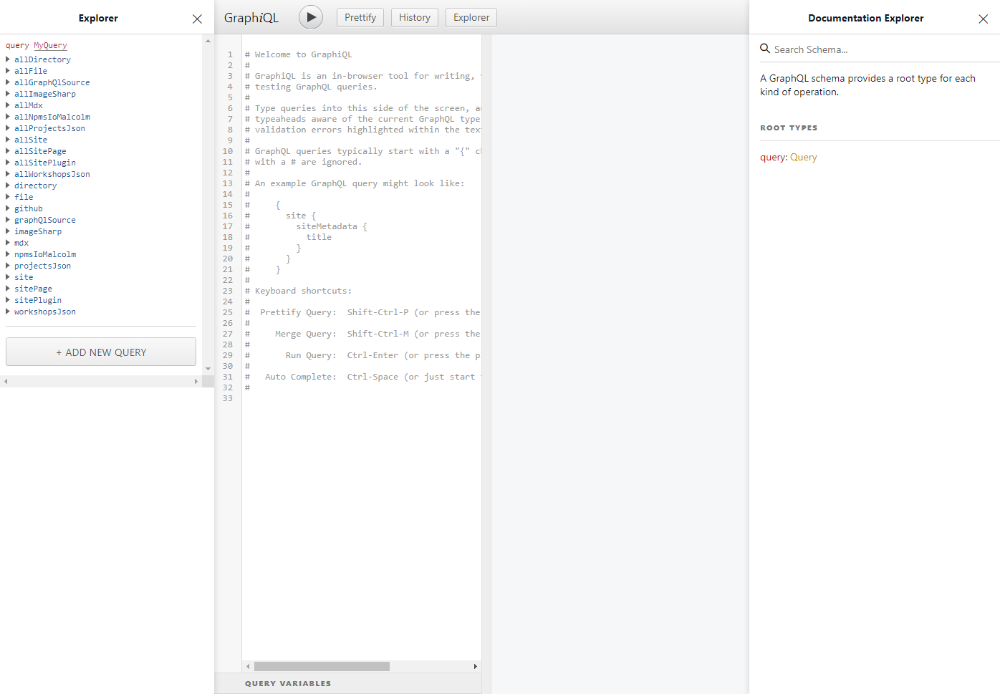

## How to Pull Data into Gatsby

One of the strength of Gatsby (but also the biggest challenge to learn it) is usage of [GraphQL] to specify the data required for a component/page.

GraphQL is a query language for API. It was designed to allows you to specify the required data when you making an API call. Usually, to implement GraphQL in your site you need to code your frontend to make GraphQL request and a server that able to understand the request and fulfill it accordingly.

In Gatsby, you write GraphQL to specify the data dependency for a component/page. GraphQL is only used during build time and will be discarded once Gatsby generates the output, therefore there is no overhead of using GraphQL to your site and GraphQL server is not required at all.

We will learn how to use GraphQL only in Gatsby context, which is specify data that you need so Gatsby know what data to inject to your components/pages during build time. If you interested to learn about using GraphQL to manage your API calls in runtime and the server to fulfills the request, [How To GraphQL][how-to-graphql] is a free and open-source tutorial to learn it.

### Using GraphQL to Pull Metadata

Let's add some metadata for our website into `gatsby-config.js`.

```javascript fileName=gatsby-config.js
module.exports = {
  // highlight-start
  siteMetadata: {
    title: 'Malcolm Kee',
    description: 'A site created with tears and love.',
  },
  // highlight-end
  plugins: ['gatsby-plugin-sass'],
};
```

### Using GraphiQL

You can access GraphiQL that allows you to make request to Gatsby in development mode at [localhost:8000/\_\_\_graphql](http://localhost:8000/___graphql)



Add the following query into GraphiQL and run it.

```graphql
query {
  site {
    siteMetadata {
      title
      description
    }
  }
}
```

You can use the documentation on the right to inspect the GraphQL schema or use the explorer on the left to generate the query for you.

## How to Inject Data into Pages/Components

In Gatsby, there are two ways of injecting data into your page/components:

- with page query
- with static query

### With Page Query

Export a constant that use `graphql` function from `gatsby` in your page.

```jsx fileName=src/pages/index.js
import { graphql } from 'gatsby'; // highlight-line
import React from 'react';
import { Layout } from '../components/layout';

// highlight-next-line
const HomePage = ({ data }) => {
  const metadata = data.site.siteMetadata; // highlight-line

  return (
    <Layout>
      {/* highlight-start */}
      <h1>Welcome to {metadata.title}'s Website</h1>
      <p>{metadata.description}</p>
      {/* highlight-end */}
    </Layout>
  );
};

// highlight-start
export const query = graphql`
  query HomePageQuery {
    site {
      siteMetadata {
        title
        description
      }
    }
  }
`;
// highlight-end
```

### With Static Query

Using `useStaticQuery` custom hooks from `gatsby` in any React component.

```jsx fileName=src/components/header.jsx
import { graphql, useStaticQuery } from 'gatsby'; // highlight-line
import React from 'react';
import './header.scss';

export const Header = () => {
  // highlight-start
  const data = useStaticQuery(graphql`
    query {
      site {
        siteMetadata {
          title
        }
      }
    }
  `);
  // highlight-end

  return (
    <header className="header">
      {/* highlight-next-line */}
      <div className="header-container">{data.site.siteMetadata.title}</div>
    </header>
  );
};
```

[graphql]: https://graphql.org/
[how-to-graphql]: https://www.howtographql.com/
