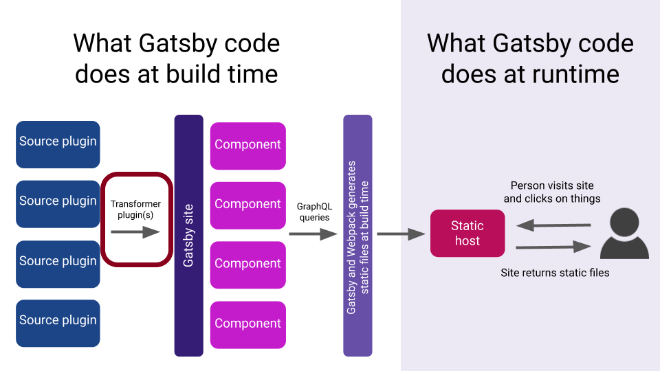

## Transformer Plugins



## Build a Page with Data from Transformer Plugin

```bash
npm i gatsby-transformer-remark
```

```javascript fileName=gatsby-config.js
module.exports = {
  plugins: [
    'gatsby-plugin-sass',
    {
      resolve: 'gatsby-source-filesystem',
      options: {
        name: 'src',
        path: `${__dirname}/src`,
      },
    },
    // highlight-start
    {
      resolve: 'gatsby-source-filesystem',
      options: {
        name: 'blogs',
        path: `${__dirname}/blogs`,
      },
    },
    'gatsby-transformer-remark',
    // highlight-end
  ],
};
```

```bash
mkdir blogs
touch blogs/my-first-blog.md blogs/second-blog.md
```

```md fileName=blogs/my-first-blog.md
---
title: 'My First Blog'
date: '2019-07-06'
---

I'm so happy to write my first blog in Gatsby!
```

```md fileName=blogs/second-blog.md
---
title: 'My Second Blog'
date: '2019-07-07'
---

This is my second blog.

Cool right?
```

Try the following query in GraphiQL:

```graphql
query {
  allMarkdownRemark {
    totalCount
    edges {
      node {
        id
        frontmatter {
          title
          date(formatString: "DD MMMM, YYYY")
        }
      }
    }
  }
}
```

Now we can add a page that display the title and date for our markdown files:

```bash
touch src/pages/blogs.js
```

```jsx fileName=src/pages/blogs.js
import { graphql } from 'gatsby';
import React from 'react';

const BlogsPage = ({ data }) => {
  return (
    <div>
      <h1>Blogs</h1>
      <p>{data.allMarkdownRemark.totalCount} posts</p>
      {data.allMarkdownRemark.edges.map(({ node }) => (
        <div key={node.id}>
          <h3>
            {node.frontmatter.title} <small>{node.frontmatter.date}</small>
          </h3>
        </div>
      ))}
    </div>
  );
};

export const query = graphql`
  query AllBlogsQuery {
    allMarkdownRemark {
      totalCount
      edges {
        node {
          id
          frontmatter {
            title
            date(formatString: "DD MMMM, YYYY")
          }
        }
      }
    }
  }
`;

export default BlogsPage;
```
