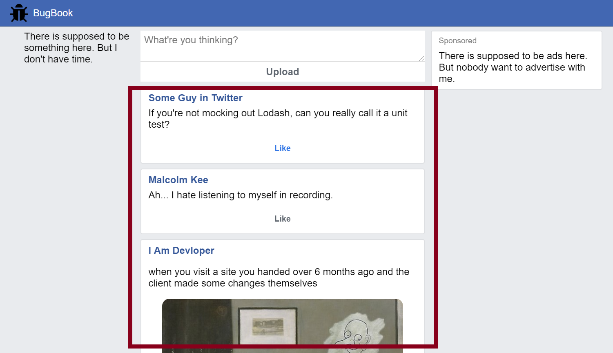

## Problem: Migration of an Existing Application to use React

We will start to write React code by migration page from HTML to use React.

Let's migrate the feed from [BugBook] to our React App.

## Copy-Paste HTML to React

We will migrate the feed by copy pasting the HTML and then tweak the html slightly to follow React JSX rules:

1. all tags must be matched with closing tag or self-closing.
1. `class` attribute should be changed to `className`.

<aside>

[Commit of the changes](https://github.com/malcolm-kee/how-to-react/commit/25b29e59c71724579e3ed4a6b13e065626ac8ad1).

</aside>

## React component as UI building block

Create `Card` component.

### `children` props

Utilize `children` props.

Exercise: [Vanilla Pokemon App][vanilla-pokemon]

[bugbook]: https://bugbook.netlify.com/
[vanilla-pokemon]: https://vanilla-pokemon.netlify.com/
[nes-css]: https://nostalgic-css.github.io/NES.css/
