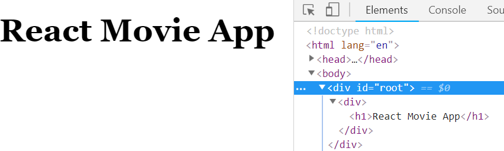

We will start learning React by using React with vanilla JS - which means we will not include any tooling first, and only code with a simple HTML file and a script tag.

This would allows us to understand React directly without distracted by all the abstraction and tooling.

## Code Setup

Following is a html page for us to start learn React.

```html
<!DOCTYPE html>
<html lang="en">
  <head>
    <meta charset="UTF-8" />
    <meta name="viewport" content="width=device-width, initial-scale=1.0" />
    <meta http-equiv="X-UA-Compatible" content="ie=edge" />
    <link
      rel="stylesheet"
      href="https://codepen.io/malcolmkee/pen/xmvMNY.css"
    />
    <title>React Movie App</title>
  </head>

  <body>
    <div id="root">not rendered</div>
    <script src="https://unpkg.com/react@16.7.0/umd/react.development.js"></script>
    <script src="https://unpkg.com/react-dom@16.7.0/umd/react-dom.development.js"></script>
    <script>
      // Your code goes here
    </script>
  </body>
</html>
```

- the codepen link is the css that I've created for this workshop to make the code-along app looks nicer. We're not going to discuss about css in this workshop.
- [unpkg] is a CDN for npm, which allows us to explore npm package easily. The two unpkg `script` tag is used to load the two packages we need to develop in ReactJS:
  - React: this is the library to construct React component, which I will introduce you right after this. It contains no way to render the component, it's just the declaration of the component.
  - ReactDOM: the rendering layer. Since we're learning about rendering in browser today, we'll be using ReactDOM. There are other rendering layer e.g. React Native, React 360 etc. Both React and ReactDOM are required, but the their orders do not matter.
- the last `script` tag would be where we write our code. It must be after the two unpkg `script` tags.

> Pro Tips: If you're using VS Code (which supports emmet out-out-the-box), you can type `html:5` can press Tab key, which will generates most of the code above.

In the `<script>` tag, add the following code

```javascript
function App() {
  return React.createElement(
    'div',
    {},
    React.createElement('h1', {}, 'React Movie App')
  );
}

const appElement = React.createElement(App);

ReactDOM.render(appElement, document.getElementById('root'));
```

- We create a component, call it as `App`. React is all about creating component, and a React component is just a function.
- A component must return a _React element_, the output of `React.createElement`. You can understand React element as a virtual markup, as it's just a representation of how the markup for the component should be, it doesn't create the markup.
- `React.createElement` is a function that takes three parameters: component type, properties, and children. For HTML element and web component, the component type would be a string (`React.createElement('h1')`); for a React component, it's the variable that refer to the component (`React.createElement(App)`).
- `ReactDOM.render` is used to render our React component to HTML. It takes two parameters:
  - the first parameter should be a React element.
  - the second parameter is the HTML element that should contains the React element. In this case, a div with id `root`.
- When we call `ReactDOM.render(elem, container)`, you can understand it as the conversations below:
  - us: **Hey React, here is a React element, make sure what's inside the container match what's produced by the React element**.
  - ReactDOM: Roger that. This React element is a function, let's run it and see what we get.
  - (Run the App function)
  - ReactDOM: Ah, it's a `div` containing a `h1` containing the text `React Movie App`. Hmm... there is nothing in the container yet, so I need to insert a div into it, and insert a h1 into the div, and finally insert the text "React Movie App". OK, done!



---

## Do It: Type the code

1.  Create a file and name it as `index.html`.
1.  Add the code above in the file.

---

## React Component Properties

Let's change our code slightly:

```javascript
function App(props) {
  return React.createElement(
    'div',
    {},
    React.createElement('h1', {}, props.appTitle)
  );
}

const appElement = React.createElement(App, { appTitle: 'React Movie App' });

ReactDOM.render(appElement, document.getElementById('root'));
```

What is displayed in our page should be as before.

- Our `App` component takes a `props` parameter (stands for properties), and use that to decide the content of the `h1` tag. Props are the input of React component.
- When we use the `App` component, we need to pass the second parameter to the `React.createElement` call.
- When the `ReactDOM.render` call runs:
  - us: **Hey React, here is a React element, make sure what's inside the container match what's produced by the React element**.
  - ReactDOM: Roger that. This React element is a function with the properties `{appTitle: 'React Movie App'}`, let's run the `App` function with the properties and see what we get.
  - (Run the App function)
  - ReactDOM: Ah, it's a `div` containing a `h1` containing the text `React Movie App`. Hmm... there is nothing in the container yet, so I need to insert a div into it, and insert a h1 into the div, and finally insert the text "React Movie App". OK, done!

## Reconciliation

What happens if we call `ReactDOM.render()` again with the same container, but different element?

```javascript
const appElementV2 = React.createElement(App, {
  appTitle: 'React Movie App v2',
});

ReactDOM.render(appElementV2, document.getElementById('root'));
```

> Note: Run the code above in your browser developer console.

The content will be updated to "React Movie App v2". Surprise!

- ReactDOM will not blow away all the DOM elements and recreate them again, because it's an expensive operation and we will lose states like focus or scroll.
- Instead, ReactDOM will do a comparison via a process called as [reconciliation], which will figure out the minimum change required to match the previously rendered DOM, in this case, just update the text content from "React Movie App" to "React Movie App v2".
- When the `ReactDOM.render` call runs:
  - us: **Hey React, here is a React element, make sure what's inside the container match what's produced by the React element**.
  - ReactDOM: Roger that. This React element is a function with the properties `{appTitle: 'React Movie App v2'}`, let's run the `App` function with the properties and see what we get.
  - (Run the App function)
  - ReactDOM: Ah, it's a `div` containing a `h1` containing the text `React Movie App v2`. Hmm... there is already something in the container, so I need to compare them now. The div is the same, leave it; inside there there is a h1, still the same, leave it; the text context is different, let's replace it! OK, done!

## Reuse React Component

Modify your code, so that it becomes

```javascript
const Movie = () =>
  React.createElement('div', { className: 'movie-container' }, [
    React.createElement('h1', {}, 'Aquaman'),
    React.createElement('h2', {}, '2018-12-07'),
  ]);

function App() {
  return React.createElement('div', {}, [
    React.createElement(
      'div',
      { className: 'title-bar' },
      React.createElement('h1', {}, 'React Movie App')
    ),
    React.createElement(Movie),
    React.createElement(Movie),
    React.createElement(Movie),
  ]);
}

ReactDOM.render(React.createElement(App), document.getElementById('root'));
```

- to make an element to have multiple children, just pass it an array of elements.
- `Movie` is our second component. I use [arrow function][arrow-function] syntax here, which will have an implicit return if the function body is a single expression
- We can have multiple `Movie` instances by calling `React.createElement` multiple times!
- `className` props will be translated to `class` properties in HTML. This is one of the few instances where React properties and HTML properties are not the same to avoid complication due to reserved JS keywords (`class` is used to declare class in JS), the others are `htmlFor`, `tabIndex` etc.
- If you're seeing console warning about keys, ignore it for now.

---

We have multiple movies but it's not very useful component yet, since not all movies has name Aquaman. Let's make Movie component a bit more useful.

```javascript
const Movie = props =>
  React.createElement('div', { className: 'movie-container' }, [
    React.createElement('h1', {}, props.name),
    React.createElement('h2', {}, props.releaseDate),
  ]);

function App() {
  return React.createElement('div', {}, [
    React.createElement(
      'div',
      { className: 'title-bar' },
      React.createElement('h1', {}, 'React Movie App')
    ),
    React.createElement(Movie, {
      name: 'Aquaman',
      releaseDate: '2018-12-07',
    }),
    React.createElement(Movie, {
      name: 'Bumblebee',
      releaseDate: '2018-12-15',
    }),
    React.createElement(Movie, {
      name: 'Fantastic Beasts: The Crimes of Grindelwald',
      releaseDate: '2018-11-14',
    }),
  ]);
}

ReactDOM.render(React.createElement(App), document.getElementById('root'));
```

- Now `Movie` is a more flexible component that renders different content based on props.

---

## Do It: Create your Movie Component

1.  Add `Movie` component in your code and use it as explained above.
1.  (Bonus) Add a new props `genres` in your `Movie` component and render it in a `span` tag.

---

[unpkg]: https://unpkg.com/
[reconciliation]: https://reactjs.org/docs/reconciliation.html
[arrow-function]: /js-the-react-parts/arrow-function
