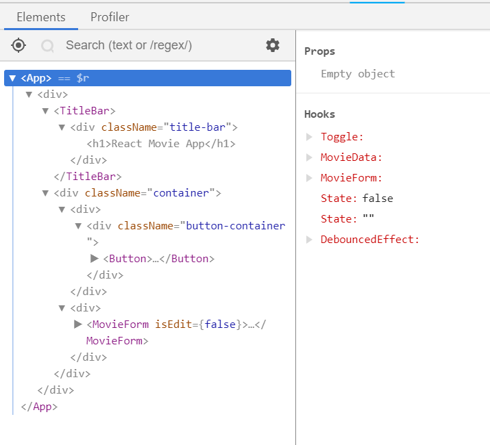

Our current application is too simple, as it's just rendering a list of movies. An actual application is usually more dynamic, e.g.:

- hide some information by default to declutter your page, but allow user click to show more
- loading data from backend api, and showing loading indicator while waiting for response

We will do that by using React Hooks.

## What's a Hook?

A Hook is a special function that lets you "hook into" React features. For example, `useState` is a Hook that lets you add React state to function components. `useEffect` allows you to make side effects, e.g. making API calls. We will explore these two hooks, but you should at least skim through the [Hooks API docs][hooks-api] after this workshop to know what is available.

## Track Component State with useState hook

Let's assume the design of our app is to display "React Movie App" title and a "Show Movies" button only by default. When user clicks the button, the movies will be shown.

To achieve that, let's modify our `App` component to:

```jsx
...
import { Button } from './components/button';
...

function App() {
  const [moviesShown, setShowMovies] = React.useState(false);

  let movies;

  if (moviesShown) {
    movies = (
      <React.Fragment>
          <Movie name="Aquaman" releaseDate="2018-12-07" />
          <Movie name="Bumblebee" releaseDate="2018-12-15" />
          <Movie
            name="Fantastic Beasts: The Crimes of Grindelwald"
            releaseDate="2018-11-14"
          />
        </React.Fragment>
    );
  }

  return (
    <div>
      <TitleBar>
        <h1>React Movie App</h1>
      </TitleBar>
      <div className="button-container">
        <Button onClick={() => setShowMovies(true)}>
          Show Movies
        </Button>
      </div>
      {movies}
    </div>
  );
}
```

- We declare a state for our `App` component with `useState` hook.
  ```javascript
  const [state, setState] = useState(initialState);
  ```
- `useState` returns a stateful value, and a function to update it. Note that the `useState` actually returns an array of 2 item, and we use the "[array destructuring][array-destructuring]" syntax to get the 2 items separately.
- When the component is rendered for the first time, returned state (`state`) will be the value pass as the first argument (`initialState`).
- The `setState` function is used to update the state. It accepts a new state value and enqueues a re-render of the component.
  ```javascript
  setState(newState);
  ```
- In subsequent render, the `state` value will always be the most recent state after applying updates.
- In the returned result, we renders `Button` element, which will call `setShowMovies(true)` method when it is clicked.
- Besides, we declare `movies` variable, which be a list of movies if `moviesShown` is true. `React.Fragment` is a container that renders nothing but allows you to wrap a list of React elements.

Let's do some cleanup to make our code terser:

1.  Get rid of `movies` variable and just inline it with `&&` expression. This is because if you returns `undefined`, `null`, or a boolean value as React element, React will not renders anything.
1.  You can replace `React.Fragment` with `<>`, a shorthand for `React.Fragment`. I prefer this way, as this expresses what `React.Fragment` really is &mdash; an empty container.

The `App` component should be as below now:

```jsx
function App() {
  const [moviesShown, setShowMovies] = React.useState(false);

  return (
    <div>
      <TitleBar>
        <h1>React Movie App</h1>
      </TitleBar>
      <div className="button-container">
        <Button onClick={() => setShowMovies(true)}>Show Movies</Button>
      </div>
      {moviesShown && (
        <>
          <Movie name="Aquaman" releaseDate="2018-12-07" />
          <Movie name="Bumblebee" releaseDate="2018-12-15" />
          <Movie
            name="Fantastic Beasts: The Crimes of Grindelwald"
            releaseDate="2018-11-14"
          />
        </>
      )}
    </div>
  );
}
```

Our current hide-show functionality only allow us to show, but we can't hide it after that. Let's enhance it.

Update the `Button` properties in `App` component:

```jsx
...
<Button onClick={() => setShowMovies(wasShown => !wasShown)}>
  {moviesShown ? 'Hide' : 'Show'} Movies
</Button>
...
```

- There are two ways to call the `setState` function:

  - pass the new value as parameter, like what we did initially:

    ```javascript
    setState(newValue);
    ```

  - pass a function that will return the new value as parameter, like this:

    ```javascript
    setState(function (prevValue) {
      return newValue;
    });

    // OR
    setState((prevValue) => newValue);
    ```

    this should be how you call `setState` if your new value depends on previous value. In our case, because toggle the value is just negation of the previous value, so this should be how we call `setShowMovies`.

Our `App` should works now where clicking the button will show movies if they are currently hidden, hide movies if they are currently shown.

## React DevTools

Before proceed further, let me introduce you to the must-have debugging tools for React developers &mdash; React DevTools. [React DevTools][react-devtools] is a browser extensions maintained by React core team to help you inspect your React components. Once installed, it will add a new tab in your browser Devtools with title "React", which you can used to inspect your React component props and hooks.



<Exercise title="Do It: use React.useState hook">

1.  Install React DevTools.
1.  Modify your `App` component to show movies only when clicked as described above.
1.  Verify that the application works as expected.

</Exercise>

<aside>

Commit: [`useState hook`](https://github.com/malcolm-kee/react-movie-app-v2/commit/f4727ed27b89c21a7e53b5d6c8c5cef6c884ce9e)

</aside>

---

## Creating Your Own Hook

Building your own Hooks lets you extract component logic into reusable functions.

Currently our `moviesShown` state works fine, but we can actually foreseen toggle state is a very common use-case. Let's create a custom hook that allows us to do that.

Let's create a `hooks` folder within `src` folder, and add a file `use-toggle.js`:

```javascript
// src/hooks/use-toggle.js
import React from 'react';

export const useToggle = (initialOn) => {
  const [on, setOn] = React.useState(initialOn);
  return [on, () => setOn((prevOn) => !prevOn)];
};
```

- `useToggle` is a custom hook that wrap the React hooks within it.
- Similar to `useState` hook, `useToggle` hook returns state and an update function. However, the update function of `useToggle` doesn't requires parameter, as it will just negate the previous value.

Let's update our `App` component to use the `useToggle` hook:

```jsx
import { useToggle } from './hooks/use-toggle';

function App() {
  const [moviesShown, toggleShowMovies] = useToggle(false);

  return (
    ...
    <Button onClick={toggleShowMovies}>
      {moviesShown ? 'Hide' : 'Show'} Movies
    </Button>
    ...
  )
}
```

- The `App` component still works as before. However, whenever we need a state that is toggle between true/false, we can reuse the `useToggle` hook.

<aside>

Commit: [`custom hook`](https://github.com/malcolm-kee/react-movie-app-v2/commit/e262eb5dbe6bfe767b3905bb564e677fedb5126c)

</aside>

## Make Side Effect with useEffect hook

Currently our movies data are hardcoded in our `App`:

```jsx
...
<>
  <Movie name="Aquaman" releaseDate="2018-12-07" />
  <Movie name="Bumblebee" releaseDate="2018-12-15" />
  <Movie
    name="Fantastic Beasts: The Crimes of Grindelwald"
    releaseDate="2018-11-14"
  />
</>
...
```

Let's load these data from backend API instead.

---

React doesn't dictate how you get data from backend, it's up to you to decide what library you want to use the make AJAX call to your backend API.

Common options:

1.  [window.fetch][fetch-api-docs] - no library required as it is supported by all modern browsers. However, polyfill required to support older browser
1.  [Axios] - Promise based HTTP client.
1.  [jQuery AJAX][jquery-ajax] - good option if JQuery is already included in your page, else bad option as it doesn't make sense to include whole JQuery library for one function only.

For this workshop, I will use Axios as example, but feel free to use other library that you prefer.

---

I've created a backend API. Open [this link](https://react-intro-movies.herokuapp.com/movies) to see its content. We will utilize this API for this exercise.

To load data from backend API:

1.  install the ajax library of your choice, e.g. `npm install axios`.
1.  create a file and name it as `api.js` with the following content: (actual code may differs based on the ajax library that you use)

    ```javascript
    import axios from 'axios';

    export const loadMovies = () =>
      axios('https://react-intro-movies.herokuapp.com/movies').then(
        (res) => res.data
      );
    ```

1.  add `useEffect` hook and another `useState` hook in `App` component as below:

    ```jsx
    ...
    import { loadMovies } from './api';

    function App() {
      const [moviesShown, toggleShowMovies] = useToggle(false);
      const [movies, setMovies] = React.useState([]);
      React.useEffect(() => {
       loadMovies().then(movieData => {
         setMovies(movieData);
       })
      }, []);

      return (
        <div>
           <TitleBar>
             <h1>React Movie App</h1>
           </TitleBar>
           <div className="button-container">
             <Button onClick={toggleShowMovies}>
               {moviesShown ? 'Hide' : 'Show'} Movies
             </Button>
           </div>
           {moviesShown &&
             movies.map(movie => (
                 <Movie
                   name={movie.name}
                   releaseDate={movie.releaseDate}
                   key={movie.id}
                 />
               ))
           }
         </div>
      );
    }

    ...
    ```

We declare a state as `movies` with `useState` hook, which is an empty array by default.

- `movies` will be used to generate a list of `<Movie>` elements with [`Array.map`][array-map] method.
- when we render a dynamic list of React elements, we need to provide a special props, `key`. `key` is used by React to identify a specific elements so that it can decide whether an item need to be unmount or just reorder the dom during reconciliation.

We use `useEffect` hook to make api call and then set the `movies` state with the response of the api call.

- `useEffect` is the React hook to perform side effects, e.g. making api call, attaching event listener etc.
- It has the function signature of `useEffect(fn, deps)`, whereby `fn` is the function that wraps the side effects call, while `deps` is an array that consists of all the dependencies that could cause the side effect to be rerun.
- In our case, because we only want our ajax call to be called once, we will pass it an empty array so it will never be rerun.

## Touching Up UI by Adding Loading Indicator

Our app is able to load data from backend API now, which is great. However, there is some problem that is not obvious to us.

Once your page load and you quickly click "Show Movies" button, you may see no movies is displayed if that API is slow. For that, we should display a loading indicator if we waiting for the API response.

<aside>

To simulate slow API response, wrap `loadMovies` function in `api.js` with this [utility](https://gist.github.com/malcolm-kee/8f3d2973872f0791ed5faea9cb4f1891).

</aside>

To show loading indicator when waiting API response:

1.  create a file `busy-container.js` in `src/components` folder with the following contents:

    ```jsx
    import React from 'react';

    export const BusyContainer = ({ isLoading, children }) => (
      <div>
        {isLoading && <span className="spinner" />}
        {children}
      </div>
    );
    ```

    - `BusyContainer` is a simple component that will render a spinning circle when its `isLoading` props is `true`.

1.  update `App` component:

    ```jsx
    import { BusyContainer } from './components/busy-container';

    function App() {
      const [moviesShown, toggleShowMovies] = useToggle(false);
      const [movies, setMovies] = React.useState([]);
      const [isLoading, setIsLoading] = React.useState(true);
      React.useEffect(() => {
        loadMovies().then((movieData) => {
          setMovies(movieData);
          setIsLoading(false);
        });
      }, []);

      return (
        <div>
          <TitleBar>
            <h1>React Movie App</h1>
          </TitleBar>
          <div className="button-container">
            <Button onClick={toggleShowMovies}>
              {moviesShown ? 'Hide' : 'Show'} Movies
            </Button>
          </div>
          {moviesShown && (
            <BusyContainer isLoading={isLoading}>
              {movies.map((movie) => (
                <Movie
                  name={movie.name}
                  releaseDate={movie.releaseDate}
                  key={movie.id}
                />
              ))}
            </BusyContainer>
          )}
        </div>
      );
    }
    ```

    - we declare another state `isLoading` and default it to true.
    - when ajax call returns, we set `isLoading` to `false`.
    - `isLoading` is passed to `BusyContainer` as props.

Let's extract out the code related to loading the movie data to a custom hook:

```jsx
function useMovieData() {
  const [movies, setMovies] = React.useState([]);
  const [isLoading, setIsLoading] = React.useState(true);
  React.useEffect(() => {
    loadMovies().then((movieData) => {
      setMovies(movieData);
      setIsLoading(false);
    });
  }, []);

  return {
    movies,
    isLoading,
  };
}

function App() {
  const [moviesShown, toggleShowMovies] = useToggle(false);
  const { movies, isLoading } = useMovieData();

  return (
    <div>
      <TitleBar>
        <h1>React Movie App</h1>
      </TitleBar>
      <div className="button-container">
        <Button onClick={toggleShowMovies}>
          {moviesShown ? 'Hide' : 'Show'} Movies
        </Button>
      </div>
      {moviesShown && (
        <BusyContainer isLoading={isLoading}>
          {movies.map((movie) => (
            <Movie
              name={movie.name}
              releaseDate={movie.releaseDate}
              key={movie.id}
            />
          ))}
        </BusyContainer>
      )}
    </div>
  );
}
```

## Rules of Hooks

There are two rules when using hooks.

1.  **Only Call Hooks at the Top Level** - Don't call hooks inside loops, conditions, or nested functions.
1.  **Only Call Hooks from React Functions** - Don't call hooks from regular Javascript functions. Instead you can:
    - call hooks from React function components.
    - call hooks from custom hooks

<Exercise title="Do It: Getting Data from Backend API">

1.  Get the movie data for your `App` from backend API instead of hand-coding them.
1.  Create `BusyContainer` as described and use it in your `App` component to show loading indicator.
1.  Verify that the application works as expected.

</Exercise>

<aside>

Commit: [`load data from api`](https://github.com/malcolm-kee/react-movie-app-v2/commit/a4b3f4a686b2f152c73ead1d2c0fe34ffcff45a7)

</aside>

---

[hooks-api]: https://reactjs.org/docs/hooks-reference.html
[array-destructuring]: /js-the-react-parts/destructuring#array-destructuring
[react-devtools]: https://github.com/facebook/react-devtools
[react-docs-batch-update]: https://reactjs.org/docs/state-and-lifecycle.html#state-updates-may-be-asynchronous
[fetch-api-docs]: https://developer.mozilla.org/en-US/docs/Web/API/Fetch_API
[axios]: https://github.com/axios/axios
[jquery-ajax]: https://api.jquery.com/jQuery.ajax/
[react-docs-lifecycle-methods]: https://reactjs.org/docs/react-component.html#the-component-lifecycle
[array-map]: /js-the-react-parts/array-methods#arraymap
