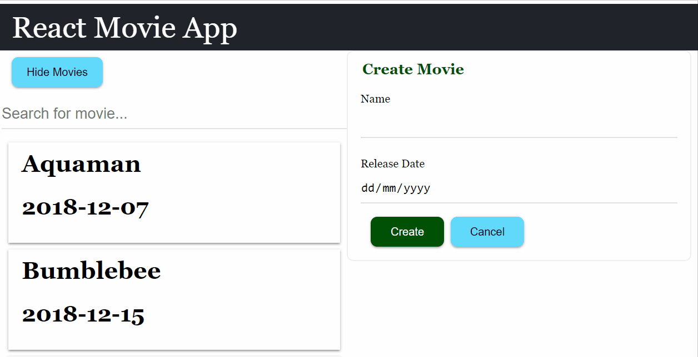

Lifting state up is a common refactoring in React app. This section will discuss when you need to do that and how to do that.

## Allow user to Edit Movie

Currently our app only allow us to create movie, but it would be better if our app allows us to edit the existing movie too. Let's do that in this section.

### Prerequisite: API Service for Edit Movie

Similar to create movie, the prerequisite for our app to support edit movie is the backend service supports it.

Let's test the API with [Restlet Client][restlet-client] that we've installed in previous section:

1.  select "PUT" in the METHOD dropdown.
1.  enter the following URL in the URL bar:
    ```
    https://react-intro-movies.herokuapp.com/movies/{movieId}
    ```
    - you need to replace `{movieId}` in the URL with the id of the movie that you want to update.
    - you can get the movie id by inspecting the payload of the [GET request](https://react-intro-movies.herokuapp.com/movies). For instance, id for "Aquaman" is 1, while id for "A Star Is Born" is 4.
1.  add the following content in the BODY field (change it to the movie you want to update):
    ```json
    {
      "id": 4,
      "name": "A Star Is Born v2",
      "releaseDate": "2018-10-03"
    }
    ```
1.  click send

Now when you load your app, you should be see your update is shown.

### Add Ajax Call Function to Make the PUT Request

Create a `saveMovie` function in `api.js`:

```javascript fileName=src/api.js
export const saveMovie = movie =>
  axios
    .put(`https://react-intro-movies.herokuapp.com/movies/${movie.id}`, movie)
    .then(res => res.data);
```

Since there is some duplications of the URL, let's refactor them:

```javascript fileName=src/api.js
import axios from 'axios';

const MOVIE_ENDPOINT = 'https://react-intro-movies.herokuapp.com/movies';

export const loadMovies = () => axios(MOVIE_ENDPOINT).then(res => res.data);

export const createMovie = movie =>
  axios.post(MOVIE_ENDPOINT, movie).then(res => res.data);

export const saveMovie = movie =>
  axios.put(`${MOVIE_ENDPOINT}/${movie.id}`, movie).then(res => res.data);
```

- similar to `axios.put`, the second parameter of `axios.put` is the data you want to submit.

### The Interaction of Edit Movie

Let's discuss how we want the edit movie interaction be like.

1.  By default, the form will be used to create movie.
1.  When user click on a movie on the movie list, the form will be populated with the details of the movie, and the form will be used to edit the movie.
1.  User can click "Cancel" button to restore the form to become create movie form again.



### Implementation Overview of Edit Movie

Now that we understand the interaction, let's discuss how are we going to implements it before we write the code.

We need to complete the following tasks:

1.  a state to track if any movie is selected. If a movie selected, make the form as an edit form, else is a create form.
1.  enhance `MovieForm` so it will display different text based on if movie is selected, e.g. submit button is labelled "Save" instead of "Create", the form title is "Edit Movie" instead of "Create Movie".
1.  add a Reset button in `MovieForm` to unselect Movie and clear out all its current form value.
1.  a way to update the form values when movie is selected, so that the values will be defaulted to the movie data.
1.  when it is edit, call `saveMovie` instead of `createMovie` api function.

Let's implements these.

### Add isEdit State

In the `App` component, let's add a `isEdit` state (which will be passed to `MovieForm` component) while `setIsEdit` will be passed to `Movie` component as `onClick` props:

```jsx
function App() {
  const [moviesShown, toggleShowMovies] = useToggle(false);
  const { movies, isLoading, loadMoviesData } = useMovieData();
  // highlight-start
  const [isEdit, setIsEdit] = React.useState(false);

  const resetForm = () => {
    setIsEdit(false);
  };
  // highlight-end

  return (
    <div>
      <TitleBar>
        <h1>React Movie App</h1>
      </TitleBar>
      <div className="container">
        <div>
          <div className="button-container">
            <Button onClick={toggleShowMovies}>
              {moviesShown ? 'Hide' : 'Show'} Movies
            </Button>
          </div>
          {moviesShown && (
            <BusyContainer isLoading={isLoading}>
              {movies.map(movie => (
                <Movie
                  name={movie.name}
                  releaseDate={movie.releaseDate}
                  {/* highlight-next-line */}
                  onClick={() => setIsEdit(true)}
                  key={movie.id}
                />
              ))}
            </BusyContainer>
          )}
        </div>
        <div>
          <MovieForm
            onSubmitSuccess={loadMoviesData}
            {/* highlight-start */}
            onReset={resetForm}
            isEdit={isEdit}
            {/* highlight-end */}
          />
        </div>
      </div>
    </div>
  );
}
```

Let's update `Movie` component to call the `onClick` props:

```jsx
export const Movie = props => (
  <div
    {/* highlight-start */}
    className="movie-container selectable"
    onClick={props.onClick}
    onKeyDown={e => {
      if (
        e.keyCode === 32 || // space
        e.keyCode === 13 // enter
      ) {
        props.onClick();
      }
    }}
    tabIndex={0} >
    {/* highlight-end */}
    <h1>{props.name}</h1>
    <h2>{props.releaseDate}</h2>
  </div>
);
```

- the `selectable` class is added for better visual hint during mouse hover.
- `onClick` props on `div` will be called when the `div` and its descendents are clicked. `tabIndex` is added so that so that it will be target of keyboard tab, and `onKeyDown` is to handle keyboard press enter or space.

And update `MovieForm` component to show different text and ability to resetForm:

```jsx
import { Button } from './components/button'; // highlight-line

...

// highlight-next-line
export const MovieForm = ({ isEdit, onSubmitSuccess, onReset }) => {
  const { values, setName, setReleaseDate } = useMovieFormData();

  const handleSubmit = ev => {
    ev.preventDefault();
    createMovie(values).then(() => {
      onSubmitSuccess();
      setName('');
      setReleaseDate('');
    });
  };

  return (
    <div className="movie-form">
      <form onSubmit={handleSubmit}>
        {/* highlight-next-line */}
        <legend>{isEdit ? 'Edit' : 'Create'} Movie</legend>
        <div className="field">
          <label htmlFor="name" className="label">
            Name
          </label>
          <input
            className="input"
            value={values.name}
            id="name"
            name="name"
            onChange={ev => setName(ev.target.value)}
            required
          />
        </div>
        <div className="field">
          <label htmlFor="releaseDate" className="label">
            Release Date
          </label>
          <input
            className="input"
            value={values.releaseDate}
            id="releaseDate"
            name="releaseDate"
            type="date"
            onChange={ev => setReleaseDate(ev.target.value)}
            required
          />
        </div>
        <div className="button-container">
          <button type="submit" className="submit-button">
            {/* highlight-next-line */}
            {isEdit ? 'Save' : 'Create'}
          </button>
          {/* highlight-next-line */}
          <Button onClick={onReset}>Cancel</Button>
        </div>
      </form>
    </div>
  );
};
```

If you try your app now, when you click the "Cancel" button, you would realize it would actually cause the page to reload.

This is because by default, clicking button in form would cause the form to be submitted. To avoid this behavior, you need to pass `type="button` to the button element. And since we would prefer this to be default behavior, let's update our `Button` component to default the `type` to `"button"`:

```jsx
export const Button = ({ type = 'button', ...props }) => (
  <button className="button" type={type} {...props} />
);
```

Now try your app, you should able to click any movie and the form labels will be updated to edit mode, and click "Cancel" will make it create mode again.

Our current status:

1.  ~~a state to track if any movie is selected. If a movie selected, make the form as an edit form, else is a create form.~~
1.  ~~enhance `MovieForm` so it will display different text based on if movie is selected, e.g. submit button is labelled "Save" instead of "Create", the form title is "Edit Movie" instead of "Create Movie".~~
1.  add a Reset button in `MovieForm` to ~~unselect Movie~~ and clear out all its current form value.
1.  a way to update the form values when movie is selected, so that the values will be defaulted to the movie data.
1.  when it is edit, call `saveMovie` instead of `createMovie` api function.

The next changes (clear form value and set form values with movie data) requires us to update the form value when movie is clicked (which is defined in `App` component), but currently the movie form data is inside `MovieForm` component, how do we do that?

### Raising State Up

For us to achieve updating form data in App, the solution is **raising state up**, i.e. move the states related to the form data from `MovieForm` component to `App` component:

```jsx
// src/app.js
...

// highlight-start
// the following code is just cut and paste from movie-form.js
const useMovieForm = () => {
  const [name, setName] = React.useState('');
  const [releaseDate, setReleaseDate] = React.useState('');
  return {
    setName,
    setReleaseDate,
    values: {
      name,
      releaseDate
    }
  };
};
// highlight-end

function App() {
  const [moviesShown, toggleShowMovies] = useToggle(false);
  const { movies, isLoading, loadMoviesData } = useMovieData();
  const [isEdit, setIsEdit] = React.useState(false);
  // highlight-start
  const { setName, setReleaseDate, values } = useMovieForm();

  const selectMovie = movie => {
    setIsEdit(true);
    setName(movie.name);
    setReleaseDate(movie.releaseDate);
  };
  // highlight-end

  const resetForm = () => {
    setIsEdit(false);
    // highlight-start
    setName('');
    setReleaseDate('');
    // highlight-end
  };

  return (
    <div>
      <TitleBar>
        <h1>React Movie App</h1>
      </TitleBar>
      <div className="container">
        <div>
          <div className="button-container">
            <Button onClick={toggleShowMovies}>
              {moviesShown ? 'Hide' : 'Show'} Movies
            </Button>
          </div>
          {moviesShown && (
            <BusyContainer isLoading={isLoading}>
              {movies.map(movie => (
                <Movie
                  name={movie.name}
                  releaseDate={movie.releaseDate}
                  {/* highlight-next-line */}
                  onClick={() => selectMovie(movie)}
                  key={movie.id}
                />
              ))}
            </BusyContainer>
          )}
        </div>
        <div>
          <MovieForm
            onSubmitSuccess={loadMoviesData}
            onReset={resetForm}
            isEdit={isEdit}
            {/* highlight-start */}
            values={values}
            setName={setName}
            setReleaseDate={setReleaseDate}
            {/* highlight-end */}
          />
        </div>
      </div>
    </div>
  );
}
```

Update `MovieForm` to use the props from parent:

```jsx
export const MovieForm = ({
  isEdit,
  onSubmitSuccess,
  resetForm,
  // highlight-start
  values,
  setName,
  setReleaseDate
  // highlight-end
}) => {
  // highlight-next-line
  // const { values, setName, setReleaseDate } = useMovieFormData();

  const handleSubmit = ev => {
    ev.preventDefault();
    createMovie(values).then(() => {
      onSubmitSuccess();
      // highlight-next-line
      resetForm();
    });
  };

  ...
};
```

Our current status:

1.  ~~a state to track if any movie is selected. If a movie selected, make the form as an edit form, else is a create form.~~
1.  ~~enhance `MovieForm` so it will display different text based on if movie is selected, e.g. submit button is labelled "Save" instead of "Create", the form title is "Edit Movie" instead of "Create Movie".~~
1.  ~~add a Reset button in `MovieForm` to unselect Movie and clear out all its current form value.~~
1.  ~~a way to update the form values when movie is selected, so that the values will be defaulted to the movie data.~~
1.  when it is edit, call `saveMovie` instead of `createMovie` api function.

### Calling different API for edit

Let's update our `MovieForm` component:

```jsx
// highlight-next-line
import { createMovie, saveMovie } from './api';
...

export const MovieForm = ({
  isEdit,
  onSubmitSuccess,
  resetForm,
  values,
  setName,
  setReleaseDate
}) => {

  const handleSubmit = ev => {
    ev.preventDefault();
    // highlight-start
    const req = isEdit ? saveMovie(values) : createMovie(values);
    req.then(() => {
    // highlight-end
      onSubmitSuccess();
      resetForm();
    });
  };

  ...
};
```

If you try it now, you may realize the save movie doesn't work. This is because saveMovie call actually require id properties in your movie data. Let's update the required code in `App` component:

```jsx
...

const useMovieForm = () => {
  const [name, setName] = React.useState('');
  const [releaseDate, setReleaseDate] = React.useState('');
  const [id, setId] = React.useState(undefined); // highlight-line
  return {
    setName,
    setReleaseDate,
    setId,  // highlight-line
    values: {
      id, // highlight-line
      name,
      releaseDate
    }
  };
};

function App() {
  ...
  const { setName, setReleaseDate, setId, values } = useMovieForm(); // highlight-line

  const selectMovie = movie => {
    setIsEdit(true);
    setName(movie.name);
    setReleaseDate(movie.releaseDate);
    setId(movie.id); // highlight-line
  };

  const resetForm = () => {
    setIsEdit(false);
    setName('');
    setReleaseDate('');
    setId(undefined); // highlight-line
  };

  return (
    ...
  );
}
```

The app should works as expected now!

<section class="exercise">

### Do It: Lifting State Up

1.  Declare `isEdit` state in `App` component.
1.  Display different text in `MovieForm` based on `isEdit` props.
1.  Move `useMovieForm` hook from `MovieForm` to `App` component.
1.  Declare `selectMovie` and `resetForm` function in `App` which will be passed on applicable component.
1.  Create `saveMovie` function.
1.  In `MovieForm` component, call `saveMovie` based on `isEdit` props.

</section>

<aside>

Commit: [`moving state up`](https://github.com/malcolm-kee/react-movie-app-v2/commit/a55513990ebd0de526324b273574a03fa566beaa)

</aside>

[restlet-client]: https://chrome.google.com/webstore/detail/restlet-client-rest-api-t/aejoelaoggembcahagimdiliamlcdmfm?hl=en
