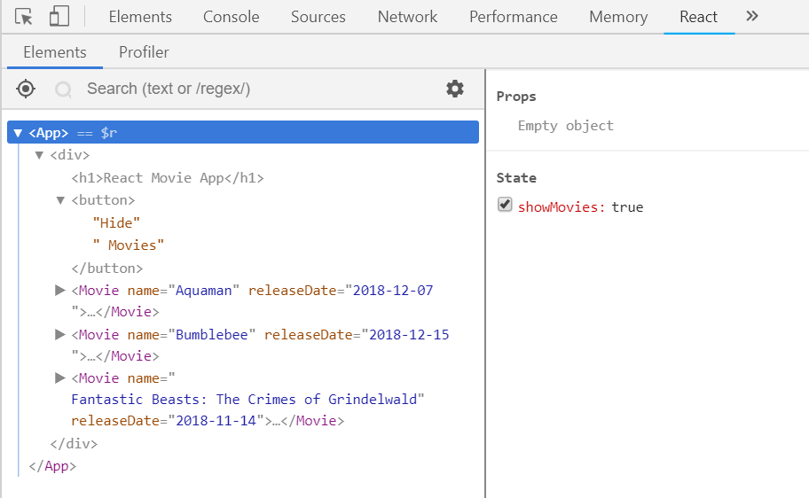

In this section, we will discuss the core API of React.

## JSX

You do not need JSX to use React, as I've shown you in [previous section](/intro-to-react-js/vanilla-react/). However, JSX would make your code a bit more readable.

Let's convert `Movie` component to using JSX. It will look like this:

```jsx fileName=src/movie.js
import * as React from 'react';

const Movie = (props) => (
  <div className="movie-container">
    <h1>{props.name}</h1>
    <h2>{props.releaseDate}</h2>
  </div>
);

export default Movie;
```

- Personally, I feel this is more readable. You may feel uncomfortable to introduce HTML in Javascript, I invite you to give it a shot until the end of this workshop.
- Comparing with the previous code, now you know what actually JSX does &mdash; it is just translating those HTML tags into `React.createElement` calls. That's it.
- Note the strange `{props.name}` syntax: this is how you output Javascript expression. It you take away `{}`, it will literally output the string `props.name`.
- Notice you still have to import React despite React not being explicitly used. As JSX is compiled to `React.createElement`, anywhere you use JSX, you need to import React. However, ESLint doesn't understand this relationship by default, thus it is yelling at you that "React is defined but never used". We will fix this later.

So now JSX is demystified a bit, let's go convert `App` and `index.js`.

```jsx fileName=src/app.js
class App extends React.Component {
  render() {
    return (
      <div>
        <div className="title-bar">
          <h1>React Movie App</h1>
        </div>
        <Movie name="Aquaman" releaseDate="2018-12-07" />
        <Movie name="Bumblebee" releaseDate="2018-12-15" />
        <Movie
          name="Fantastic Beasts: The Crimes of Grindelwald"
          releaseDate="2018-11-14"
        />
      </div>
    );
  }
}
```

```jsx fileName=src/index.js
ReactDOM.render(<App />, document.getElementById('root'));
```

- Notice that why first letter of `Movie` is capitalized. It _must_ be. If you make it lowercase, it will try to have `movie` as a web component and not a React component.
- We now pass props down as we add attributes to an HTML tag.

### Configure Babel to compile JSX

If you try to compile the code by running `npm run build` now, it will throw `SyntaxError`. This is because Babel does not recognize JSX by default since JSX is not part of Javascript &mdash; it's just a syntatic sugar introduced to make React code more readable.

Therefore, we need to configure Babel so that it will recognize JSX and compile them to `React.createElement` calls.

1. run `npm install -D @babel/preset-react`
2. add `@babel/preset-react` into `.babelrc` presets.
   ```json fileName=.babelrc
   {
     "presets": ["@babel/preset-env", "@babel/preset-react"]
   }
   ```

Now when you start webpack-dev-server, the compilation should succeeds and your app should work as before.

<Exercise title="Exercise">

1. Update `index.js`, `app.js`, and `movie.js` to use JSX as described above.
1. Configure Babel to compile JSX.
1. Restart webpack-dev-server and verify that the application still works as before.

Commit: [`070-jsx-config`](https://github.com/malcolm-kee/react-movie-app/tree/070-jsx-config)

</Exercise>

## React States and Lifecycle Methods

Our current app is too simple, as it's just rendering a list of movies. In an actual webapp, our application need to be more complex, e.g.:

- hide some information by default to declutter your page, but allow user click to show more
- loading data from backend api, and showing loading indicator while waiting for response

We will do that by using React states and lifecycle methods

### Use React States to track UI states e.g. show/hide

Let's assume the design of our app is to display "React Movie App" title and a "Show Movies" button only by default. When user clicks the button, the movies will be shown.

To achieve that, let's modify our `App` component to:

```jsx fileName=src/app.js
class App extends React.Component {
  constructor(props) {
    super(props);
    this.state = {
      showMovies: false,
    };
    this.showMovies = this.showMovies.bind(this);
  }

  showMovies() {
    this.setState({
      showMovies: true,
    });
  }

  render() {
    let movies;

    if (this.state.showMovies) {
      movies = (
        <React.Fragment>
          <Movie name="Aquaman" releaseDate="2018-12-07" />
          <Movie name="Bumblebee" releaseDate="2018-12-15" />
          <Movie
            name="Fantastic Beasts: The Crimes of Grindelwald"
            releaseDate="2018-11-14"
          />
        </React.Fragment>
      );
    }

    return (
      <div>
        <div className="title-bar">
          <h1>React Movie App</h1>
        </div>
        <div className="button-container">
          <button onClick={this.showMovies} className="button">
            Show Movies
          </button>
        </div>
        {movies}
      </div>
    );
  }
}
```

- We declare `constructor` for our `App` and initialize our state with `this.state = { showMovies: false }`. Note that I've told you previously that class component is more powerful, and state is one of the functionality that only available for class component (at least for now).
- React state should always be a plain Object, while the value of the properties it totally up to you.
- Because `this` is dynamic in Javascript, we need to bind `this` keywords in `showMovies` methods to the component with the following code:
  ```javascript noWrapper
  this.showMovies = this.showMovies.bind(this);
  ```
  (This binding is required for _each_ custom method that you define for React component. I will show you how to avoid those tedious repetitions slightly later.)
- We declare a `showMovies` methods, which will call `this.setState`. `setState` is a method that is available to all React class component (the component inherit this method via `extends React.Component`), and it's only way for you to update states. If you update state directly (`this.state.showMovies = true`), React will not be notified that the state has been change and thus will not re-render your component, then what is displayed will be incorrect.
- When we call `setState`, React will merge the object we provide it with its current state, then it will rerender the component.
- In the `render` method, we create a `button` element which will call `showMovies` method when it is clicked.
- Besides, we declare `movies` variable in `render` method, which be a list of movies if `this.state.showMovies` is true. `React.Fragment` is a container that renders nothing but allows you to wrap a list of React elements.

Before we proceed, there is some cleanup that I want to suggest:

1. Get rid of `movies` variable and just inline it with `&&` expression.
1. You can replace `React.Fragment` with `<>`, Babel would understand that `<>` is actually `React.Fragment`. I prefer this way, as this expresses what `React.Fragment` really is &mdash; an empty container.

The `App` component should be as below now:

```jsx fileName=src/app.js
class App extends React.Component {
  constructor(props) {
    super(props);
    this.state = {
      showMovies: false,
    };
    this.showMovies = this.showMovies.bind(this);
  }

  showMovies() {
    this.setState({
      showMovies: true,
    });
  }

  render() {
    return (
      <div>
        <div className="title-bar">
          <h1>React Movie App</h1>
        </div>
        <div className="button-container">
          <button onClick={this.showMovies} className="button">
            Show Movies
          </button>
        </div>
        {this.state.showMovies && (
          <>
            <Movie name="Aquaman" releaseDate="2018-12-07" />
            <Movie name="Bumblebee" releaseDate="2018-12-15" />
            <Movie
              name="Fantastic Beasts: The Crimes of Grindelwald"
              releaseDate="2018-11-14"
            />
          </>
        )}
      </div>
    );
  }
}
```

### Use Class Properties Syntax

It is tedious and error-prone to remember and write the binding for each of your component methods. Luckily, you could use the class properties syntax.

Convert your `App` component as below:

```jsx fileName=src/app.js
class App extends React.Component {
  state = {
    showMovies: false
  };

  showMovies = () => {
    this.setState({
      showMovies: true
    });
  }

  render() {
    ...
  }
}
```

This is much more terse than previous code. However, you would see some compilation error now because class properties is still at proposal phase and it is not included as part of `preset-env` nor `preset-react`. To make babel understand additonal syntax, we need to install plugin to "teach" it to parse the syntax.

1. Install the babel plugin:

   ```bash
   npm install -D @babel/plugin-proposal-class-properties
   ```

1. Update `.babelrc` as below:

   ```json fileName=.babelrc highlightedLines=3
   {
     "presets": ["@babel/preset-env", "@babel/preset-react"],
     "plugins": ["@babel/plugin-proposal-class-properties"]
   }
   ```

1. Restart webpack-dev-server.

Your code should works now, but with terser code.

### React DevTools

One last thing before you write your code, install browser extension for [React DevTools][react-devtools]. The extension will add a new tab in your browser Devtools with title "React", which you can used to inspect your React component props and states.



<Exercise title="Exercise">

1. Install React DevTools.
1. Configure babel to parse class properties syntax.
1. Modify your `App` component to show movies only when clicked as described above.
1. Verify that the application works as expected.

Commit: [`080-hide-movies`](https://github.com/malcolm-kee/react-movie-app/tree/080-hide-movies)

</Exercise>

### Configure ESLint for React App

Currently ESLint is having parsing error. Let's configure ESLint before proceed further.

1. install required packages
   ```bash
   npm install -D eslint-plugin-react babel-eslint
   ```
2. update `.eslintrc`:

```json fileName=.eslintrc
{
  "extends": [
    "eslint:recommended",
    "plugin:react/recommended",
    "prettier",
    "prettier/react"
  ],
  "plugins": ["react"],
  "rules": {
    "react/prop-types": 0
  },
  "parser": "babel-eslint",
  "parserOptions": {
    "ecmaVersion": 2016,
    "sourceType": "module",
    "ecmaFeatures": {
      "jsx": true
    }
  },
  "env": {
    "es6": true,
    "browser": true,
    "node": true
  },
  "settings": {
    "react": {
      "version": "16.7"
    }
  }
}
```

- `plugin:react/recommended` are set of rules included as part of `eslint-plugin-react`.
- `react` is added to the `plugins`, in which ESLint will lookup `eslint-plugin-react`. This plugin "teach" ESLint to recognize all the JSX are using `React.createElement` under the hood, so it doesn't show `React is not being used` error.
- `babel-eslint` is specified as the parser. This allows eslint to use babel to parse the code, which will process the code based on our `.babelrc` config.
- React version is added to `settings`, in which `eslint-plugin-react` depends on to suggest applicable rules.
- `react/prop-types` rules is overwritten, as we're not going to use `prop-types` in this workshop. I personally think that prop-types does not worth the investment &mdash; I recommend [Typescript] if you want to introduce type-checking in your project.

<Exercise title="Exercise">

1. Configure ESLint as described above.
1. Run `npm run lint` and verify that no more linting error is shown.

Commit: [`090-eslint-react`](https://github.com/malcolm-kee/react-movie-app/tree/090-eslint-react)

</Exercise>

### More on setState

Our current hide-show functionality only allow us to show, but we can't hide it after that. Let's enhance it.

Modify `App` to be following:

```jsx fileName=src/app.js
class App extends React.Component {
  state = {
    showMovies: false,
  };

  toggleMovies = () =>
    this.setState((prevState) => ({
      showMovies: !prevState.showMovies,
    }));

  render() {
    return (
      <div>
        <div className="title-bar">
          <h1>React Movie App</h1>
        </div>
        <div className="button-container">
          <button onClick={this.toggleMovies} className="button">
            {this.state.showMovies ? 'Hide' : 'Show'} Movies
          </button>
        </div>
        {this.state.showMovies && (
          <>
            <Movie name="Aquaman" releaseDate="2018-12-07" />
            <Movie name="Bumblebee" releaseDate="2018-12-15" />
            <Movie
              name="Fantastic Beasts: The Crimes of Grindelwald"
              releaseDate="2018-11-14"
            />
          </>
        )}
      </div>
    );
  }
}
```

- Button content has been enhanced to show different text based on the state. As explained previously, we need `{}` to code JS expression, else it would be treated as string.
- `showMovies` method is renamed to `toggleMovies` and its content changed. Now the parameters to `setState` is no longer an object but a function. This is because [React may batch multiple `setState` calls into a single update for performance][react-docs-batch-update]. Therefore, if our `setState` is dependent on previous value of state, the correct way to call `setState` is to pass it a function, in which the parameters of the function would be the previous state (`prevState`).

In short, you can pass `setState` either of the following:

1. the change that you wish React to apply (use this if the new value doesn't depends on previous value), OR
   ```javascript noWrapper
   this.setState({ show: true });
   ```
1. a function that returns the change (use this if the new value depends on previous value)
   ```javascript noWrapper
   this.setState((prevState) => ({ show: !prevState.show }));
   ```

Another things about `setState` that may surprise React beginner is that it is asynchronous, which means that when you call `setState`, the state will not be updated straight-away (you can verify this by adding `console.log(this.state)` after `setState` call). If you want to perform some action whenever state is updated, you can provide a callback as second parameter to `setState`:

```javascript noWrapper
this.setState({ show: true }, () => {
  // this will only be called after React apply the state change
  console.log(this.state);
});
```

<Exercise title="Exercise">

1. Enhance your `App` component to show/hide movies when button is clicked and display different button text, as described above.
1. Verify that the application works as expected.

Commit: [`100-toggle-movies`](https://github.com/malcolm-kee/react-movie-app/tree/100-toggle-movies)

</Exercise>

### Getting Data from Backend API

Currently our movies data are hardcoded in our `App`:

```jsx fileName=src/app.js
...
<>
  <Movie name="Aquaman" releaseDate="2018-12-07" />
  <Movie name="Bumblebee" releaseDate="2018-12-15" />
  <Movie
    name="Fantastic Beasts: The Crimes of Grindelwald"
    releaseDate="2018-11-14"
  />
</>
...
```

Let's load these data from backend API instead.

<hr />

React doesn't dictate how you get data from backend, it's up to you to decide what library you want to use the make AJAX call to your backend API.

Common options:

1. [`window.fetch`][fetch-api-docs] - no library required as it is supported by all modern browsers. However, polyfill required to support older browser
1. [Axios] - Promise based HTTP client.
1. [jQuery AJAX][jquery-ajax] - good option if JQuery is already included in your page, else bad option as it doesn't make sense to include whole JQuery library for one function only.

For this workshop, I will use Axios as example, but feel free to use other library that you prefer.

<hr />

I've created a backend API. Open [this link](https://react-intro-movies.herokuapp.com/movies) to see its content. We will utilize this API for this exercise.

To load data from backend API:

1. install the ajax library of your choice, e.g. `npm install axios`.
1. create a file and name it as `api.js` with the following content: (actual code may differs based on the ajax library that you use)

   ```javascript fileName=src/api.js
   import axios from 'axios';

   export const loadMovies = () =>
     axios('https://react-intro-movies.herokuapp.com/movies').then(
       (res) => res.data
     );
   ```

1. modify your `App` constructor and define a `componentDidMount` method as below:

   ```jsx fileName=src/app.js
   import * as React from 'react';
   import Movie from './movie';
   import { loadMovies } from './api'; // highlight-line

   class App extends React.Component {
     state = {
         showMovies: false,
         movies: [] // highlight-line
     };

    // highlight-start
     componentDidMount() {
       loadMovies().then(movies => this.setState({ movies }));
     }
     // highlight-end

     ...
   ```

   - `componentDidMount` is one of the [React component lifecycle methods][react-docs-lifecycle-methods]. `componentDidMount` will be called immediately after a component is mounted (inserted into DOM).
   - There are a few lifecycle methods that you can define to invoke functions at certain lifecycles of React component, e.g. `componentWillUnmount` (which will be called before component is removed) and `componentDidUpdate` (which will be called when the props/states of a component has been changed). Read through the [docs][react-docs-lifecycle-methods] to get a rough idea what each method does, and refer back whenever you are unsure.
   - Verify in "Network" tab of your browser devtools an API call has been made. Inspect the state of your `App` with React DevTools, and you should able to see the `movies` states is loaded with the data from the API.

1. Update `render` method of your `App`:

   ```jsx
   class App extends React.Component {
     ...
      render() {
        return (
          <div>
            <div className="title-bar">
              <h1>React Movie App</h1>
            </div>
            <div className="button-container">
              <button onClick={this.toggleMovies} className="button">
                {this.state.showMovies ? 'Hide' : 'Show'} Movies
              </button>
            </div>
            {this.state.showMovies &&
              this.state.movies.map(movie => (
                <Movie
                  name={movie.name}
                  releaseDate={movie.releaseDate}
                  key={movie.id}
                />
              ))}
          </div>
        );
      }
   }
   ```

   - as `this.state.movies` is an array, we use [`Array.map`][array-map] method to loop through the array and render a list of `Movie` component instances.
   - when you render a dynamic list of component, you need to provide a special props, `key`. `key` is used by React to identify a specific component instance so that it can decide whether an item need to be unmount or just reorder the dom whenever the list change.

### Touching Up UI by Adding Loading Indicator

Our app is able to load data from backend API now, which is great. However, there is some problem that is not obvious to us.

Once your page load and you quickly click "Show Movies" button, you may see no movies is displayed if that API is slow. For that, we should display a loading indicator if we waiting for the API response.

<aside>

To simulate slow API response, wrap `loadMovies` function in `api.js` to with this [utility](https://gist.github.com/malcolm-kee/8f3d2973872f0791ed5faea9cb4f1891).

</aside>

To show loading indicator when waiting API response:

1. create a file `busy-container.js` in `src` folder with the following contents:

   ```jsx fileName=src/busy-container.js
   import * as React from 'react';

   export const BusyContainer = ({ isLoading, children }) => (
     <div>
       {isLoading && <span>loading...</span>}
       {children}
     </div>
   );
   ```

   - `BusyContainer` is a simple component that will render "loading..." text when its `isLoading` props is `true`. In an actual application, you may want to add some fancy spinner svg here.
   - `children` is a special props for React components. It's the contents within the JSX tags (if you remember, the third parameters to `React.createElement`).

1. update `App` component:

   ```jsx fileName=src/app.js
   import * as React from 'react';
   import { loadMovies } from './api';
   import { BusyContainer } from './busy-container'; // highlight-line
   import Movie from './movie';

   class App extends React.Component {
     state = {
       showMovies: false,
       isLoading: true, // highlight-line
       movies: [],
     };

     componentDidMount() {
       loadMovies().then((movies) =>
         this.setState({ movies, isLoading: false })
       ); // highlight-line
     }

     toggleMovies = () => {
       this.setState((prevState) => ({
         showMovies: !prevState.showMovies,
       }));
     };

     render() {
       return (
         <div>
           <div className="title-bar">
             <h1>React Movie App</h1>
           </div>
           <div className="button-container">
             <button onClick={this.toggleMovies} className="button">
               {this.state.showMovies ? 'Hide' : 'Show'} Movies
             </button>
           </div>
           {this.state.showMovies && (
             // highlight-next-line
             <BusyContainer isLoading={this.state.isLoading}>
               {this.state.movies.map((movie) => (
                 <Movie
                   name={movie.name}
                   releaseDate={movie.releaseDate}
                   key={movie.id}
                 />
               ))}
               {/* highlight-next-line */}
             </BusyContainer>
           )}
         </div>
       );
     }
   }
   ```

   - we initiate state with additional props, `isLoading` and set it as `true`.
   - when ajax call returns, we set `isLoading` to `false`.
   - `isLoading` is passed to `BusyContainer` as props.

<Exercise title="Exercise">

1. Get the movie data for your `App` from backend API instead of hand-coding them.
1. Create `BusyContainer` as described and use it in your `App` component to show loading indicator.
1. Verify that the application works as expected.

Commit: [`110-ajax-calls`](https://github.com/malcolm-kee/react-movie-app/tree/110-ajax-calls)

</Exercise>

[typescript]: https://www.typescriptlang.org/
[react-devtools]: https://github.com/facebook/react-devtools
[react-docs-batch-update]: https://reactjs.org/docs/state-and-lifecycle.html#state-updates-may-be-asynchronous
[fetch-api-docs]: https://developer.mozilla.org/en-US/docs/Web/API/Fetch_API
[axios]: https://github.com/axios/axios
[jquery-ajax]: https://api.jquery.com/jQuery.ajax/
[react-docs-lifecycle-methods]: https://reactjs.org/docs/react-component.html#the-component-lifecycle
[array-map]: https://developer.mozilla.org/en-US/docs/Web/JavaScript/Reference/Global_Objects/Array/map
