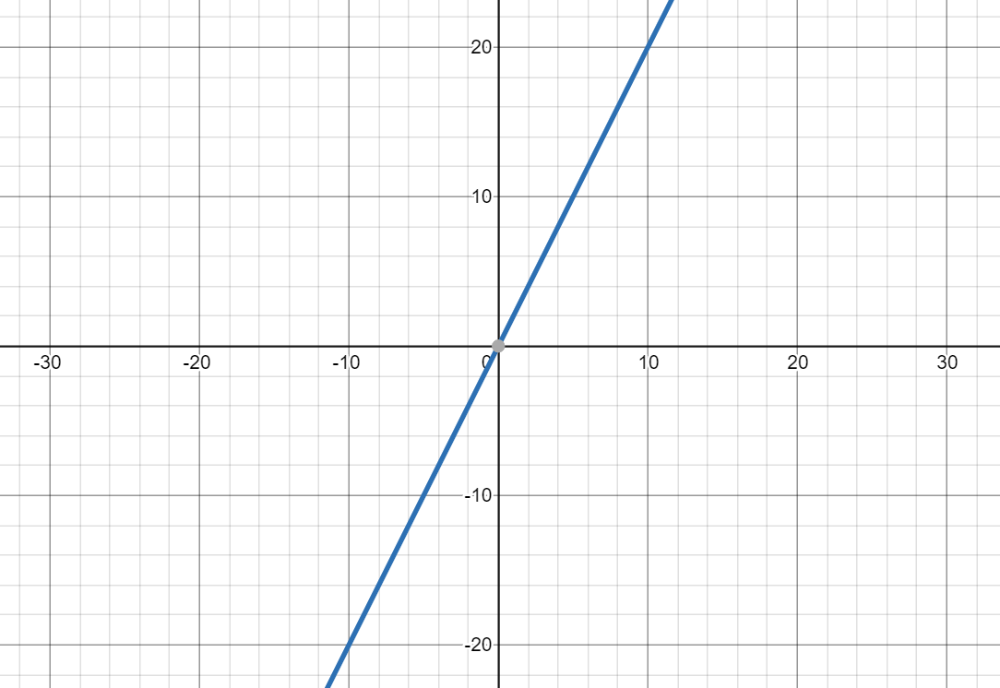
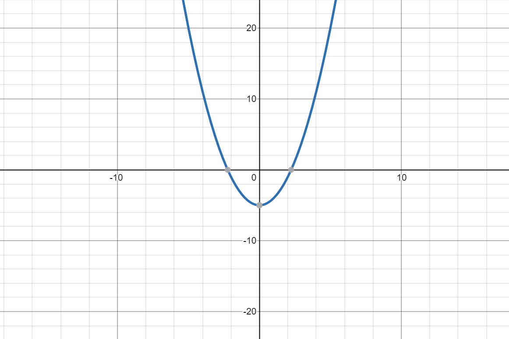

Functional programming is not programming with the `function` keyword; if that's so, then every JavaScript developer knows functional programming.

## What is a Function?

For most of people that never read about functional programming, function is just a block of code that is wrapped with `function` keyword that could be used once or multiple times.

While this definition is reasonable, **function** in functional programming is has a more strict definition.

**Function** in functional programming is function in mathematical sense.

In mathematics, function is a relationship between input(s) and an output, like `y = f(x)`.

Let's say an equation is defined as `f(x) = 2x`. What does it means? We can illustrate it with a graph:



For each value of input (value of x-axis), the function will produce an output (y-axis). For example, input of 2 produces output of 4, input of 10 produces output of 20.

A slightly complex example of function is <code>f(x) = x<sup>2</sup> - 5</code>, which is illustrated below:



Now I'm not trying to confuse you or teaching you mathematics, but please note the following characteristics of both mathematics function, regardless if it's simple or complex:

1. A function always takes input(s) (x), and always gives an output (y). Multiple inputs may results in similar output, but function would not produces multiple outputs.
1. The relationship is deterministic. Regardless of who, when, or how you use the function, a set of input(s) always produces the same output.

### Function vs Procedure

Functional programming is about embracing using functions as function in mathematical sense.

The meaning of function that you may be more accustomed are known as procedure. What's the difference? A procedure is just a collection of functionality, it may have inputs, it may not. It may have an output (`returns` value), it may not.

In contrast, a function takes input(s) and always `returns` value.

Examples of function:

- returns the sum of all the parameters provided to it
- returns the biggest number among the parameters provided to it
- accepts an array of numbers and returns a _new_ array that consists of positive number only
- accepts an array of numbers and returns a _new_ array that contains similar numbers but is sorted.

Examples of procedure:

- `window.alert`
- `console.log`
- make an API call and returns the result
- modify the `class` attribute of a DOM element

When you want to program in functional way, it means you should be _using function as much as possible_, and trying to avoid procedure **whenever possible**. Note that I emphasis "whenever possible" because you may have already realize some proceduress are necessary, e.g. making API calls etc, modify DOM etc.

In fact, all software we write must have procedures for it to be useful (even the most mathematical software like a calculator need to change its display to be useful). However, some frameworks allows you to write functional code which it will translate to procedures. For instance, when we write code in ReactJS, we write our component as a pure function, and React will translate it to procedures e.g. modify `class` attribute, creating/appending DOM element etc.

Because the word "function" are also used to describe procedure as well, another way you may heard people compare between them is the term pure function versus impure function.

## Pure Function

Let's translate the discussion of previous section to concrete characteristics that we can use to determine a function is a pure function (function that works like mathematical function):

1. Its return value is the same for the same arguments. (Same input(s), same output).
1. Running it will not cause side effects.

Let's discuss them in more details.

### Same output for same arguments

Arguments are the input we provide to a function, e.g. in the following example:

```javascript
add(2, 3, 4);
```

`2`, `3`, and `4` are the arguments provided to `add` function.

In what case, add will be pure, and how it could be impure?

```js live
// this example is pure
function add(x, y, z) {
  return x + y + z;
}

let sum = 0;
// this example is impure, because it returns different value when you call it second time with the same parameters
function add(x, y, z) {
  sum = sum + x + y + z;
  return sum;
}

// this example is impure, because it returns different value even though all parameters stay the same
function add(x, y, z) {
  return x + y + z + Math.random();
}
```

The examples above are pretty obvious. What about the following example?

```js live
function double(x = 1) {
  return x * 2;
}
```

`double` utilize the default parameter that we've discussed in [previous section](/js-the-react-parts/destructuring#destructuring-in-function-parameter/), therefore it can be invoked without parameter:

```javascript
double(); // 2
double(1); // 2
double(2); // 4
```

`double` may not be a function in mathematical sense, because mathematical function must accepts input. However, because `double` always provides same output given same arguments, therefore it's still considered as pure function.

### No Side Effects

One technique that you've probably used in most code you've written, and maybe even didn't think about it much, is to have a function output some or all of its values by simply changing variables outside it.

For example, our previous `double` function could be implemented below:

```js live
let result;

function double(x = 1) {
  result = x * 2;
}

double(3);

console.log(result); // 6
```

We could have `return` the value instead of assigning it to `result` from within the function:

```js live
function double(x = 1) {
  return x * 2;
}

let result = double(3);

console.log(result); // 6
```

Both code accomplish the same task, so should we choose one version over the other one? **Yes**, we should choose the second version.

The output of second version is explicity by `return` the result, meanwhile the output of first version is an implicit output. Implicit output should be avoided and they have a special name in functional programming: side effects.

They are named as side effects as a contrast to the only purpose of a pure function: computing the output.

However, assigning value to a variable outside the function is not the only way to perform side effects, consider the following example:

```js live
function sumNumbers(numbers) {
  let total = 0;
  for (let i = 0; i < numbers.length; i++) {
    if (!numbers[i]) numbers[i] = 0;

    total += numbers[i];
  }

  return total;
}

const nums = [1, 2, , 3];

sumNumbers(nums); // 6
```

Can you spot the side effect of `sumNumbers` function?

<details>
  <summary>Answer (Click to show)</summary>
  <p>
    It modify <code>nums</code> array on line 4.
  </p>
</details>

Following are some examples of side-effects:

- modifying variable in outer scope
- modifying parameters pass to it
- making changes to DOM
- making API calls

You may notice that the examples of side-effects is similar to examples of procedures, which is expected. Procedure is impure function, because it will cause side effects.

To recap, given same parameters, pure function produces same output by `return` it without producing other changes (side effects).

<Exercise title="Exercise">

Determine if each of the following functions is a pure function:

```js live
const person = {
  name: 'Malcolm Kee',
  age: 29,
};

const getAge = () => person.age;
const isUnderage = (person) => person.age < 18;
const getNextYearAge = (person) => person.age + 1;
const makePersonOlder = (person) => person.age++;
```

```js live
const persons = [
  { name: 'Malcolm Kee', isWeird: true },
  { name: 'Matthew Yong', isWeird: false },
  { name: 'Tristan Gomez', isWeird: true },
];

const getFirstNames = (persons) =>
  persons.map((person) => person.name.split(' ')[0]);

const getFirstPerson = () => persons[0];

const getWeirdPersons = () => persons.filter((person) => person.isWeird);

const groupPersonByWeirdness = (persons) => {
  const weirdos = [];
  const normals = [];

  function groupPerson(person) {
    if (person.isWeird) {
      weirdos.push(person);
    } else {
      normals.push(person);
    }
  }

  persons.forEach(groupPerson);

  return { weirdos, normals };
};
```

</Exercise>

## First Class Function

Another concept in functional programming is "first class function". When we say function is "first class", what we actually means is that they are just like everyone else... which means we treat them just like other data type like number or boolean, e.g. passing them around, storing it in array, assign to parameter etc (a characteristic that we discuss briefly in the [closure section](/js-the-react-parts/closure/)).

Functional programming utilizes this features to compute function just like how we usually compute data. I would like to introduce you a few more techniques to illustrate what this means.

### callAll

`callAll` is an utility function to combine multiple functions into a single function, which will invoke each of the function with the parameters provided to it.

```javascript
const logSum = (x, y) => console.log(x + y);
const logMultiply = (x, y) => console.log(x * y);
const logDiff = (x, y) => console.log(Math.abs(x - y));

const logSumMultiplyAndDiff = callAll(logSum, logMultiply, logDiff);

logSumMultiplyAndDiff(2, 3);
// 5
// 6
// 1
```

The implementation of `callAll` is actually very short, but may takes some time to digest:

```js live
const callAll = (...fns) => (...args) =>
  fns.forEach((fn) => typeof fn === 'function' && fn(...args));
```

It's rewritten more verbosely to make it easier to understand:

```js live
// callAll accepts any numbers of function as parameters, which will be collected into an array called fns
const callAll = (...fns) =>
  // and return a combinedFn function, which accepts any numbers of parameters collected into args array
  function combinedFn(...args) {
    // due to closure, combinedFn has access to fns array
    // it will go through the fns array and invoke each item by spreading all the parameters
    // to the item if the array item is a function
    fns.forEach((fn) => typeof fn === 'function' && fn(...args));
  };
```

You may notice that even though `callAll` is a pure function, but that doesn't mean the function it returns is a pure function! I highlight it here to re-emphasize the point that functional programming in JavaScript is not a yes-or-no question, you make your code functional one function at a time, it's an ongoing effort.

### pipe

`pipe` combines multiple functions into a single function, in which the output of that a function will become input for the next function.

```javascript
const triple = (x) => x * 3;
const increment = (x) => x + 1;

const tripleThenIncrement = pipe(triple, increment);
tripleThenIncrement(2); // (2 * 3) + 1 = 7

const incrementThenTriple = pipe(increment, triple);
incrementThenTriple(2); // (2 + 1) * 3 = 9
```

The implementation of `pipe`, just like `callAll`, is short but takes time to digest:

```js live
const pipe = (...fns) => (arg) => fns.reduce((result, fn) => fn(result), arg);
```

A more verbose version:

```js live
// pipe accepts any numbers of function as parameters, which will be collected into an array called fns
const pipe = (...fns) =>
  // and return a pipedFn function, which accepts only one argument
  function pipedFn(arg) {
    let result = arg;
    // due to closure, pipedFn has access to fns array
    // it will go through the array and use the result of previous function as parameter of next function
    fns.forEach((fn) => {
      // we loop through
      result = fn(result);
    });

    return result;
  };
```

In contrast with `callAll` (where it doesn't restrict what function you can pass to it), pipe restrict that the function that you can pass into it must be a pure function and only accept one parameter (known as [unary function][unary]).

### Composing Functions

You can join `callAll` and `pipe` together, like this:

```javascript
const double = (x) => x * 2;
const plusOne = (x) => x + 1;
const cube = (x) => x * x * x;

const logAll = callAll(
  pipe(double, console.log),
  pipe(plusOne, double, console.log),
  pipe(cube, console.log)
);

logAll(2);
// 2 * 2 = 4
// (2 + 1) * 2 = 6
// 2 * 2 * 2 = 8
```

Now this example may seems trivial, but there are many more this kind of functions in functional programming, such as:

- `compose(...fns)`: work just like `pipe` but the order of invocation is from right to left
- `memoize(fn)`: help you to save the result of your function, so when similar parameters is provided again, it will returns the result instead of do the computation again.
- `debounce(fn, minInterval)`: make sure your function will not invoke more than once within an interval.

With those utilities, you can create complex computation and logics.

## Array Methods from Functional Programming Perspective

Now you have some understanding about function programming, let's review the methods that we learn in [Array Methods](/js-the-react-parts/array-methods/) sections.

- The callback that you pass to `Array.filter`, `Array.map`, and `Array.reduce` should be pure function. Besides, those methods are functional because they don't change the original array. Instead, they always returns a new function.
- The callback that you pass to `Array.forEach` would not be functional. However, this doesn't mean that you shouldn't avoid using it, sometimes using `forEach` is cleaner than using `reduce`.

## Why Functional Programming?

Before we ends this section, let's talk about why I think functional programming is a good paradigm to program in:

- easy to refactor

  If you're lucky, most of your programming work are just creating new code, not enhancing existing code or fixing bug. But for most of us, programming works is a combination of writing new code while enhancing/fixing bug. Therefore, I think it's important for code to be easy to be changed.

  The good thing about functional code (pure function) is that it is very straightforward to figure the dependency of it (the parameter) and the dependent code (the function that call it). With that knowledge, it's easy to access the impact of changing/deleting the code.

  In contrast with impure function, for you to access the impact of changing a piece of code, you need to figure out manually all the variables that it's updating, and then all the code that is accessing those variables. Good luck with that!

- easy to test

  When you write automated test (if you're not, please do!), testing functional code is painless. Because pure function only depends on parameters, you test different scenarios by just changing the parameters. To assert the result, you just test the returns value of the function call. No setup, no cleanup.

However, as mentioned previously, using functional programming is not a yes or no question. Most of the time, your code would be a mix of functional and non-functional code, but the lesson to keep in mind is that try to program in functional way whenever it make sense.

## Further Reading

- [Functional-Light JavaScript](https://github.com/getify/Functional-Light-JS)
- [Professor Frisby's Mostly Adequate Guide to Functional Programming](https://mostly-adequate.gitbooks.io/mostly-adequate-guide/)

[unary]: https://en.wikipedia.org/wiki/Unary_function
