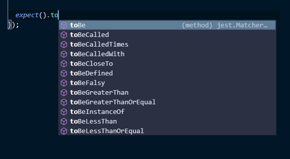

In last section, we create our own wrapper to test function.

In this section, we will learn to write tests using [Jest].

## Creating a canary test

Create a file in `src` folder and name it `canary.spec.js` with the following content:

```js fileName=src/canary.spec.js
test(`canary test`, () => {
  expect(true).toBe(true);
});
```

Run the following command in your command line:

```bash
yarn test
```

You should be able to see the output similar to below:

```bash
PASS  src/canary.spec.js
√ canary test (5ms)

Test Suites: 1 passed, 1 total
Tests:       1 passed, 1 total
Snapshots:   0 total
Time:        3.53s
```

Let's walkthrough what we've just did:

1. When we execute `yarn test` in the command line, it will runs the command being configured in `scripts.test` in `package.json`, which is `react-scripts test`.

   ```json fileName=package.json highlightedLines=6
   {
     ...
     "scripts": {
       "start": "react-scripts start",
       "build": "react-scripts build",
       "test": "react-scripts test",
       "eject": "react-scripts eject",
       "start:docs": "styleguidist server",
       "build:docs": "styleguidist build"
     }
     ...
   }
   ```

1. `react-scripts` is the command provided by Create React App. `react-scripts test` is the command that execute tests in your project. Under the hood, it uses [Jest].

1. By default, Jest will search in `src` folder any file that matches the pattern `*.spec.js`, `*.spec.jsx`, `*.test.js`, and `*.test.jsx` and treat them as test files. Since `canary.test.js` matches the pattern, it will be selected by Jest and executed.

1. Jest run all the files and report the test result summary in the command line.

1. Note that Jest will not exit after all the tests are run. Instead, it will keep watching your files and rerun all the tests if any files is edited. This is very handy as you get instant result of your changes.

<aside>

Is the canary test above testing anything at all?

At first glance, it seems not, because `true` will always equals to `true`. However, the purpose of canary test is not to test any code, but to test your testing framework setup.

I usually add a canary test when I trying to setup testing for a project, and remove it later once I have a few tests up and running.

</aside>

Now that we verify our test setup is working fine, it's time to write our first test.

## Write Test for Pure Function

Let's write a test for [pure functions][pure-function], as they are usually easy to test.

Codes in `src/lib` folder are utilities functions, some of them pure and some not.

Let's test the `camelize` function in `src/lib/camelize.js`.

Create a `camelize.spec.js` file next to `camelize.js` with the following contents:

```js fileName=src/lib/camelize.spec.js
import { camelize } from './camelize';

test(`camelize`, () => {
  expect(camelize('background-color')).toBe('backgroundColor');
});
```

<aside>

Technically speaking, it is not mandatory to put your test next to the code under test and also name it similarly. Jest will be able to find it as long as its file name match the test filename patterns.

However, this is a convention that has been used by many projects because it allows you to know which code has test written for it by checking if there is any test next to it within the same folder.

</aside>

Let's write a few more test cases:

```js fileName=src/lib/camelize.spec.js
import { camelize } from './camelize';

test(`camelize`, () => {
  expect(camelize('background-color')).toBe('backgroundColor');
  // highlight-start
  expect(camelize('border-top-color')).toBe('borderTopColor');
  expect(camelize('margin')).toBe('margin');
  expect(camelize('marginLeft')).toBe('marginLeft');
  expect(camelize('')).toBe('');
  // highlight-end
});
```

And the test is still passing!

If you're like me, you probably will start doubting yourself if everytime goes too well. Let's "pinch ourselves" by introducing bug to our code:

```js fileName=src/lib/camelize.js
const hyphenPattern = /-(.)/g;

/**
 * camel-case a hyphenated string
 * @example camelize('background-color') => 'backgroundColor'
 */
export function camelize(stringWithHyphen) {
  return stringWithHyphen.replace(hyphenPattern, function(_, character) {
    // highlight-start
    // return character.toUpperCase();
    return character;
    // highlight-end
  });
}
```

Now you should be seeing the test fail!

```bash
FAIL  src/lib/camelize.spec.js
  × camelize (13ms)

  ● camelize

    expect(received).toBe(expected) // Object.is equality

    Expected: "backgroundColor"
    Received: "backgroundcolor"

      2 |
      3 | test(`camelize`, () => {
    > 4 |   expect(camelize('background-color')).toBe('backgroundColor');
        |                                        ^
      5 |   expect(camelize('border-top-color')).toBe('borderTopColor');
      6 |   expect(camelize('margin')).toBe('margin');
      7 |   expect(camelize('marginLeft')).toBe('marginLeft');

      at Object.<anonymous>.test (src/lib/camelize.spec.js:4:40)
```

Let's revert back the changes and you should be seeing the test pass again.

<Exercise title="Exercise">

1. Write tests for the `map` function in `src/lib/array.js`.
1. (Optional) Write tests for the `flattenArray` function in `src/lib/array.js`.

</Exercise>

## Assertion

Let's write a test for `pick` function in `src/lib/object.js`:

```js fileName=src/lib/object.spec.js
import { pick } from './object';

test(`pick`, () => {
  expect(
    pick(
      {
        a: 'A',
        b: 'B',
      },
      ['a']
    )
  ).toBe({
    a: 'A',
  });
});
```

And the test fails!

```bash
● pick

  expect(received).toBe(expected) // Object.is equality

  If it should pass with deep equality, replace "toBe" with "toStrictEqual"

  Expected: {"a": "A"}
  Received: serializes to the same string

    10 |       ['a']
    11 |     )
  > 12 |   ).toBe({
       |     ^
    13 |     a: 'A',
    14 |   });
    15 | });

    at Object.<anonymous> (src/lib/object.spec.js:12:5)
```

If you `console.log` the result of the `pick` call, you would see `{a: 'A'}`. Why does it fail?

If you read the error message above, you may already know why. This is because `.toBe` assertion compare value using `Object.is`, which check for identity equality if the comparison is between two objects.

Fortunately, the error message also tell us how to fix that: just change the assertion from `.toBe` to `toStrictEqual`, and the test will pass.

The test teaches us something new: we need to be careful that our comparisons is about two objects or two primitive value. But how do we know other assertions that are available in Jest?

Two things to help you discover:

1. Scan through [Jest `expect` documentation][expect-docs].
1. Enable Intellisense to provide suggestions.

Scanning through the docs will be left as an exercise for you. I will show you how to enable Intellisense.

To enable Intellisense, you need to install `@types/jest` (TypeScript definition for Jest) by running the following commands:

```bash
yarn add -D @types/jest
```

Once the installation completed, Intellisense will shows you the available assertion as shown below:



Now you're be able to explore available assertions.

<Exercise title="Exercise">

1. Install Jest type definition to enable Intellisense.
1. Write tests for the `omit` function in `src/lib/object.js`.

</Exercise>

[jest]: https://jestjs.io/
[pure-function]: /js-the-react-parts/functional-programming#pure-function
[expect-docs]: https://jestjs.io/docs/en/expect
