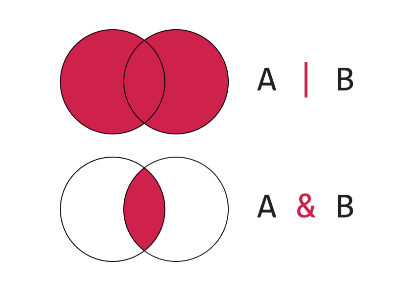

When we have a variable, we can perform operations on it. For example, we can use `*` to multiply two numbers, use `.split` to split a string into an array.

If we have a type, we can perform operations on it too. We're going to discuss few of them in this lesson.

## Type Alias

Type alias is the naming of type, so you can reuse it.

```ts live
// instead of
const sanitize = (data: string | number) => {};
const clean = (data: string | number) => {};

// create a type alias to reuse
type StringOrNumber = string | number;
const sanit = (data: StringOrNumber) => {};
const clea = (data: StringOrNumber) => {};
```

Type alias is not limited to primitive, you can use it to name object type or function signature as well.

```ts live
type Job = {
  name: string;
  salary: number;
};

const a: Job = {
  name: 'programmer',
  salary: 0,
};

type Callback = () => void;

const hello: Callback = () => {
  console.log('Hello!');
};

type NumberOrStringArray = Array<number | string>;

const items: NumberOrStringArray = [3, 'three', 4, 5];
```

Most of the thing that you can do using `interface` can be done using `type`, so I usually just use `type` whenever possible.

<aside>

What are the things that `interface` can do but `type` can't?

1. declaration merging (extending an existing interface). This is usually only concerned by library developer, in which their interface can be extended. (We will discuss how to extend third-party library type definition in the [Using Third Party Types](/typescript-for-react-developer/using-third-party-types))
1. self-reference. Because `type` is eagerly evaluated, therefore you can't use declare a `type` that refers itself. Meanwhile, `interface` is lazily evaluated, therefore it can refer itself. Nonetheless, this limitation of `type` is removed in TypeScript 3.7, which is just released few weeks ago before this workshop. An example of self-reference type looks like this:

</aside>

## Intersection & Union

```ts live
/**
 * Union types
 * Sometimes we have a type that can be one of several things
 */

interface WithPhoneNumber {
  name: string;
  phone: number;
}

interface WithEmail {
  name: string;
  email: string;
}

let contactInfo: WithPhoneNumber | WithEmail =
  Math.random() > 0.5
    ? {
        // we can assign it to a WithPhoneNumber
        name: 'Malcolm',
        phone: 60174444444,
      }
    : {
        // or a WithEmail
        name: 'Malcolm',
        email: 'malcolm@example.com',
      };

contactInfo.name; // NOTE: we can only access the .name property  (the stuff WithPhoneNumber and WithEmail have in common)

/**
 * Intersection types
 */
let otherContactInfo: WithPhoneNumber & WithEmail = {
  //   we _must_ initialize it to a shape that's asssignable to WithEmail _and_ WithPhoneNumber
  name: 'Malcolm',
  email: 'malcolm@example.com',
  phone: 601744444444,
};

otherContactInfo.name; // NOTE: we can access anything on _either_ type
otherContactInfo.email;
otherContactInfo.phone;
```

Takeaways:

1. Union is like OR operator. In mathematics, union is represented by two overlapping circles with both of them covered.
1. Intersection is like AND operator. In mathematics, intersection is presented by two overlapping circles with the overlapped parts covered.



## Accessing Type of an Object Type Property

Sometimes you want to extract out the type of an Object Type and use it somewhere. Consider the example below:

```ts
type PersonDetails = {
  name: string;
  address: {
    unit: string;
    streetOrBuilding: string;
    street: string;
  }
}

export const updateAddress = (
  currentDetails: PersonDetails, 
  address: {
    unit: string;
    streetOrBuilding: string;
    street: string;
  }
): PersonDetails => ({
  ...currentDetails,
  address
})
```

`updateAddress` is a function that accept two parameters: `currentDetails` which is the current value, and `address` which is the new address details, and merge them together and returns a new object.

Note that we have duplicated the address type in two places. We can remove that duplication by creating a type for the address:

```ts
// highlight-start
type Address = {
  unit: string;
  streetOrBuilding: string;
  street: string;
}
// highlight-end

type PersonDetails = {
  name: string;
  address: Address; // highlight-line
}

export const updateAddress = (
  currentDetails: PersonDetails, 
  address: Address // highlight-line
): PersonDetails => ({
  ...currentDetails,
  address
})
```

However, sometimes this is not possible because you don't have control over type definition (e.g. type from library) so you can't just refactor the type definition.

The solution is to extract the type of the property like this:

```ts
type PersonDetails = {
  name: string;
  address: {
    unit: string;
    streetOrBuilding: string;
    street: string;
  }
}

export const updateAddress = (
  currentDetails: PersonDetails, 
  address: PersonDetails['address'] // highlight-line
): PersonDetails => ({
  ...currentDetails,
  address
})
```

## Differentiating Type and Runtime: Declaration Space

One of the implicit understanding of TypeScript is that there are two types of declaration: type declaration and variable declaration. 

Following are a few type declarations:

```ts noWrapper
interface Animal {
  name: string;
  greet: () => void;
}

type Person = {
  firstName: string;
  talk: () => void;
}
```

Which means you can use them as type annotation:

```ts noWrapper
const animal: Animal = {
  name: 'dog',
  greet: () => {
    console.log(`Woff! Woff!`)
  }
}

const me: Person = {
  firstName: 'Malcolm',
  talk: () => {
    console.log(`Hello!`);
  }
}
```

But you can't use them as variable:

```ts noWrapper
const person = Person; // Error
```

Similarly, when you declare a variable, you can't use it as type annotation:

```ts live
const person = {
  name: '',
  talk: () => {
    console.log(`Sawatika`);
  }
}

const me: person = {
  name: '',
  talk: () => {
    console.log(`Sawatika`);
  }
}
```

If what you want is to get the type of a variable and apply it to another variable, you can use the `typeof` keyword:

```ts live
const person = {
  name: '',
  talk: () => {
    console.log(`Sawatika`);
  }
}

const me: typeof person = {
  name: '',
  talk: () => {
    console.log(`Sawatika`);
  }
}
```

<aside>

`typeof` is a keyword that works differently depends on the context it's being used. When used in variable space, it's just a typical JavaScript [`typeof`][typeof] operator that returns a string indicating the type. When used in declaration space, it's used to extract out the type of a variable.

</aside>

## Escape Hatch: Type Assertion

Sometimes, some values are really dynamic that there are no ways for TypeScript to do type-checking for you. 

Consider the following example:

```ts live
const profileImage = document.querySelector('#profile');

console.log(profileImage.src) // Error because `src` property may not be there
```

If we really sure that the `document.querySelector` call returns an image, we can make a type assertion to tell TypeScript:

```ts noWrapper
const profileImage = document.querySelector('#profile');

console.log((profileImage as HTMLImageElement).src); // highlight-line
```

Note that type assertion does nothing in runtime; if the `document.querySelector` calls above returns a `div` instead of a `img`, the call could cause error.

[typeof]: https://developer.mozilla.org/en-US/docs/Web/JavaScript/Reference/Operators/typeof