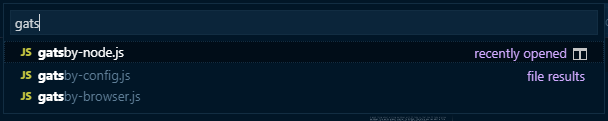

[Visual Studio Code][vs-code] (VS Code) is a editor built to suit the needs of web developers. We'll learn about how to use the features provided by it and customizing it to make our web development easier.

However, many features we learning here doesn't applies to VS Code only, but works with other editor as well (you may need to configure manually). So rest assured that what you'll learn today will help you in your coding exercise, even though you don't use VS Code.

## Creating Document

In this section, we'll going to talk about how to create document with VS Code.

### Markdown

Markdown is a markup language with text formatting syntax. It's the de facto markup language for developer.

- If you go to most repo in [GitHub], the bottom of the repo will display the content of the `README.md` file in the folder.
- Many form that support rich text editing also supports markup, e.g. Issue and Pull Request form in GitHub, Jira etc.
- Many tools have been built to support markdown. For instance, this website content is generated with markdown. You can see all the markdown [here][website-repo].

You can learn markdown in few minutes. Just go through this [cheatsheet][markdown-cheatsheet] and you're good to go.

A good thing about writing markdown with VS Code is that how VS Code preview markdown file works almost similar to GitHub, therefore you can edit a file locally and preview how it looks like in VS Code directly.

To edit and preview a markdown file in VS Code:

1.  create a file that ends with `.md`, e.g. `my-note.md`.
1.  create some content with markdown.
1.  press `Ctrl+Shift+P`
1.  right click the preview file tab and press "Split Right", and then you can drag it to the right panel.

### Emmet

- speed up repetitive typing with `Tab`
- built into VS Code
- plugins available for most editors
- using CSS selectors to generate HTML
- cursor is usually placed at where you need to typing next

**span**

```html noWrapper
<span></span>
```

**span.special**

```html noWrapper
<span class="special"></span>
```

**.my-class**

```html noWrapper
<div class="my-class"></div>
```

**section.class-1.class-2#main-section**

```html noWrapper
<section class="class-1 class-2" id="main-section"></section>
```

- just like in CSS:

| Selector | Description |
| -------- | ----------- |
| >        | children    |
| +        | sibling     |

**ul>li.item**

```html noWrapper
<ul>
  <li class="item"></li>
</ul>
```

**.nav+.main-content+.footer**

```html noWrapper
<div class="nav"></div>
<div class="main-content"></div>
<div class="footer"></div>
```

**ul.list>li.item\*5**

```html noWrapper
<ul class="list">
  <li class="item"></li>
  <li class="item"></li>
  <li class="item"></li>
  <li class="item"></li>
  <li class="item"></li>
</ul>
```

<Exercise title="Exercise">

1.  Find from internet the emmet shortcut to generate base html5 structure
1.  What would be the code for generating the following structure:
    ```html noWrapper
    <div>
      <ul>
        <li></li>
        <li></li>
        <li></li>
      </ul>
    </div>
    ```
1.  What would be the code for generating a table with 10 rows and 2 columns?
1.  Create a code for generating the following structure:
    ```html noWrapper
    <html>
      <head>
        <title></title>
      </head>
      <body></body>
    </html>
    ```

</Exercise>

## Editing Document

This section describes the tricks and tips that you would find useful when editing code in VS Code.

### Go To

- You can open any file by its name when you type `Ctrl+P` (Quick Open).

  

- Hold `Ctrl` and press `Tab` to view a list of all files open in an editor group. To open one of these files, use `Tab` again to pick the file you want to navigate to, then release `Ctrl` to open it.

- You can navigate symbols inside a file with `Ctrl+Shift+O` or `Ctrl+P` and type `@`.

  

- You can go to the definition of a symbol by pressing `F12` or with `Ctrl+Click`.

### Multi-Cursor & Line Manipulation

- Holding `Alt` and click on a position create multiple cursors that you can type at the same time.

<aside>

Tips: If you click wrongly, you can press `Ctrl+U` to undo last selection.

</aside>

- Use `Ctrl+D` to select next occurrence. Similar to `Alt+Click`, you can use `Ctrl+U` to skip specific occurrence.
- Holding `Alt+Shift` while dragging allows you to create multi cursor across line.
- All multi cursor selections above enable powerful refactoring or code transforming, because each of it has its own clipboard instance.

### Renaming

- Level 1: Find and Replace
- Level 2: Multi select (`Ctrl+D`) and change
- Level 3: `F2` rename

When you use `F2` to rename, VS Code would actually try to analyze your code to find where the rename should be performed as well.

### Code Snippets

If you have some code that you use very frequently but isn't included in emmet, you can configure your own, known as "User Snippet" in VS Code.

Example:

```json
{
  "Import lodash": {
    "prefix": "iml",
    "body": "import $1 from 'lodash/$1';",
    "description": "import lodash module"
  }
}
```

<Exercise title="Exercise">

1.  Use multi-cursor to create an array of object with properties `name` and `age`, based on the data of the table [here](https://gist.github.com/malcolm-kee/d92e8b60ce1369eadc06b7e6f9a88b70#file-multi-cursor-html).
1.  Use VS Code rename to rename the function `add` to `totalUp` in this [javascript file](https://gist.github.com/malcolm-kee/d92e8b60ce1369eadc06b7e6f9a88b70#file-rename-function-js).

<aside>

Credit: Emmet exercises adapted from [this gist](https://gist.github.com/cirops/4715058)

</aside>

</Exercise>

[vs-code]: https://code.visualstudio.com/
[github]: https://github.com/
[website-repo]: https://github.com/malcolm-kee/frontend-developer-toolbox
[markdown-cheatsheet]: https://github.com/adam-p/markdown-here/wiki/Markdown-Cheatsheet
